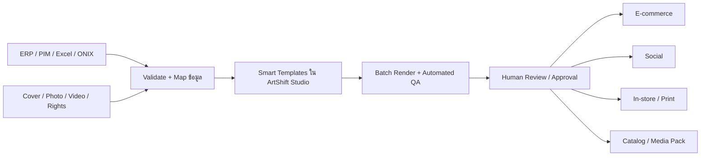

# ArtShift Product Strategy — จาก Local-first Design Studio สู่ Creative Operations สำหรับธุรกิจหนังสือ

> จัดทำเมื่อ 12 สิงหาคม 2026 จากการสำรวจโค้ดและสถานะ Git/GitHub ปัจจุบัน ประกอบกับมาตรฐานอุตสาหกรรมหนังสือ รูปภาพ และสิ่งพิมพ์ดิจิทัล

## ข้อเสนอหลัก

ArtShift ไม่ควรเริ่มต้นด้วยการเป็น “Canva อีกตัว” หรือโปรแกรมออกแบบอเนกประสงค์ แต่ควรยึดปัญหาที่องค์กรหนังสือและสื่อเจอซ้ำทุกสัปดาห์เป็นจุดตั้งต้น:

> **นำข้อมูลหนังสือและ media asset ที่อนุมัติแล้วหนึ่งชุด ไปสร้าง creative pack หลายช่องทางแบบ batch โดยลดงานซ้ำ ลดการส่งต่อ และป้องกันข้อมูลสินค้าเพี้ยน**

ชื่อเชิงผลิตภัณฑ์ที่ใช้คิดงานได้ชัดคือ **Creative Operations for Book Commerce**

North Star ที่ควรใช้ทดสอบแนวคิด:

> **จากข้อมูลหนังสือที่อนุมัติแล้ว 1 รายการ สร้าง creative pack พร้อมใช้ทุกช่องทางภายใน 5 นาที โดยไม่มีข้อมูล ISBN ชื่อ ผู้เขียน ราคา หรือโปรโมชันคลาดเคลื่อน**

ตัวเลข 5 นาทีเป็นสมมติฐานสำหรับ pilot ไม่ใช่คำสัญญาทางการตลาด จนกว่าจะวัดจากงานจริง

## เหตุผลที่ทิศทางนี้เหมาะกับ ArtShift

ArtShift มีสินทรัพย์ทางเทคนิคที่ใช้ต่อได้ทันที:

- Canvas2D editor ที่ควบคุม object, layout, multi-slide และ template ได้เอง
- Thai fonts และการ export PNG, PDF, PPTX
- PDF import, background removal, image adjustments และ local vision AI
- AI tool-use ที่แก้ canvas เป็นโครงสร้าง ไม่ได้สร้างเพียงภาพแบน
- local-first architecture ที่เหมาะกับงานต้นแบบ งานข้อมูลอ่อนไหว และการใช้งานแบบไม่พึ่ง backend

แต่สถานะปัจจุบันยังเป็น **single-user creation tool** ไม่ใช่ SaaS:

- เอกสารอยู่ใน `localStorage` ของ browser เดียว
- ไม่มี organization, account, workspace, database, object storage หรือ sync
- ไม่มี role, approval, comment, audit log, job queue หรือ connector กับ ERP/PIM/DAM
- template ยังไม่เป็น data-bound smart template สำหรับผลิตหลาย SKU

ดังนั้นสิ่งที่มีมูลค่าที่สุดไม่ใช่เพิ่มเครื่องมือวาดให้กว้างขึ้น แต่คือเพิ่ม “ระบบงานรอบ editor” ให้ข้อมูลไหลจากต้นทางไปยังชิ้นงานอย่างปลอดภัยและวัดผลได้

## ปัญหาที่ควรเลือกเป็น Wedge แรก

ตัวอย่าง workflow ที่มีโอกาสสร้าง ROI สูงในบริษัทหนังสือขนาดใหญ่:

1. Merchandising หรือ Marketing ส่ง Excel/CSV พร้อม ISBN, ชื่อ, ผู้เขียน, ปก, ราคาปก, ราคาขาย และช่วงโปรโมชัน
2. Designer ทำภาพ e-commerce, social post, banner, ป้ายหน้าร้าน, shelf talker, catalog หรือ presentation ซ้ำหลายขนาด
3. มีการแก้ราคา ข้อความ ปก และวันโปรโมชันผ่านแชตหรืออีเมลหลายรอบ
4. Designer export, ตั้งชื่อไฟล์, แยก folder และส่งต่อเอง
5. เมื่อข้อมูลเปลี่ยน ต้องย้อนแก้หลายชิ้นและเสี่ยงตกหล่น

ArtShift ควรเปลี่ยน workflow นี้เป็น:



## ลำดับโอกาสผลิตภัณฑ์

| ลำดับ | แนวทาง | Impact | ความเข้ากับของเดิม | คำแนะนำ |
|---|---|---:|---:|---|
| 1 | **Book Campaign Pack Automation** — feed หนึ่งชุดสร้างหลาย channel/size | สูงมาก | สูงมาก | ทำก่อน เป็น core product |
| 2 | **Retail Signage & Promotion Studio** — ป้ายราคา, shelf talker, POS, catalog | สูง | สูงมาก | ใช้เป็น pilot ที่เห็น ROI เร็ว |
| 3 | **Publisher–Retailer Media Pack Hub** — ผู้จัดพิมพ์ส่งข้อมูล/ปก/สิทธิ์ครั้งเดียว ร้านค้าดึงชุดล่าสุด | สูงมาก | ปานกลาง | สร้างเป็น moat หลังพิสูจน์ workflow ภายใน |
| 4 | **Accessibility Pack** — alt text, accessibility metadata, EPUB/PDF checks | สูง | ปานกลาง | ทำเป็น add-on เมื่อ data pipeline แข็งแรง |
| 5 | **Video Derivative Automation** — resize, caption, intro/outro, product reels | ปานกลาง–สูง | ปานกลาง | ทำภายหลัง ไม่เริ่มด้วย full video editor |

สิ่งที่ไม่ควรเริ่มในระยะแรก:

- generic design editor ที่แข่งด้วยจำนวน feature
- full DAM ที่ต้องแทนระบบ asset management ทั้งองค์กร
- social scheduler แบบครบวงจร
- full nonlinear video editor
- text-to-image เป็นคุณค่าหลักของผลิตภัณฑ์

ตลาด creative automation แบบทั่วไปมีผู้เล่นที่ทำ bulk creation, template API, brand governance และ multichannel production อยู่แล้ว เช่น Canva Bulk Create, Bannerbear, Adobe GenStudio และ CHILI GraFx ดังนั้นความได้เปรียบต้องมาจาก **workflow เฉพาะธุรกิจหนังสือ + metadata/rights + ภาษาไทย + integration + ต้นทุนที่เหมาะกับภูมิภาค** ไม่ใช่แค่ “สร้างภาพจำนวนมากได้”

## รูปแบบผลิตภัณฑ์ที่แนะนำ

แยกผลิตภัณฑ์เป็นชั้น เพื่อรักษาคุณค่าของ local-first เดิมและไม่บังคับให้ editor แบกทุกอย่าง:

### 1. ArtShift Studio

ตัว editor ปัจจุบัน ทำหน้าที่ออกแบบ smart template และแก้รายละเอียดชิ้นงาน

- ยังใช้ client-side rendering และ local editing ได้
- กำหนด field เช่น `title`, `author`, `cover`, `listPrice`, `salePrice`, `promoEnd`
- ล็อก logo, legal copy, brand color และ safe area
- รองรับ fallback layout เมื่อชื่อยาว ปกแนวตั้ง/แนวนอน หรือข้อความไทยตัดบรรทัดต่างกัน

### 2. ArtShift Ops

Cloud control plane สำหรับองค์กร:

- organizations, workspaces, users, roles และ SSO ใน enterprise tier
- catalog/campaign data, versioning และ source-of-truth mapping
- asset library พร้อมสิทธิ์ใช้งาน วันหมดอายุ และเจ้าของลิขสิทธิ์
- request, comment, approval, audit log และ notification
- connector กับ ERP, PIM, DAM, Drive, object storage และช่องทางปลายทาง

### 3. ArtShift Render

งานเบื้องหลังสำหรับการผลิตจำนวนมาก:

- render queue, retry, idempotency และ job report
- output naming convention และ folder/package manifest
- visual/data QA ก่อนส่งให้คนอนุมัติ
- PNG/JPEG/PDF/PPTX และ ZIP campaign pack

### 4. ArtShift Network — ระยะยาว

เครือข่ายแลกเปลี่ยน **approved book media pack** ระหว่างสำนักพิมพ์ ผู้จัดจำหน่าย ร้านหนังสือ และ media partner โดยผูกกับ ISBN/edition/format:

- bibliographic และ commercial metadata
- cover, product image, synopsis, author photo, trailer หรือ press asset
- copyright owner, licensor, usage terms, territory และ expiry
- version, approval state และ content provenance

นี่คือจุดที่สร้าง impact ระดับอุตสาหกรรม เพราะลดการจัดเตรียมและตรวจซ้ำระหว่างหลายบริษัท ไม่ได้ลดเพียงเวลาของ designer ในบริษัทเดียว

## MVP แรก: Campaign Pack

### Input

- CSV/XLSX ก่อน แล้วค่อยเพิ่ม ONIX 3.1 และ API
- คอลัมน์ขั้นต่ำ: ISBN, title, author, publisher/imprint, cover URL/file, list price, sale price, campaign dates
- optional: category, synopsis, badge, store/region, coupon, QR/barcode, rights fields

### Core workflow

1. Upload data และ cover assets
2. Map column เข้ากับ canonical field ของ ArtShift
3. Validate required fields, ISBN, duplicate row, date และ asset resolution
4. เลือก brand kit, campaign และ smart template set
5. Preview sample 3–5 SKU ที่เป็น edge case
6. Generate ทุก SKU × ทุก channel/size
7. Automated QA แล้ว human review
8. Export ZIP พร้อม manifest, naming convention และ error report

### Feature ที่ต้องมีใน MVP

- data binding สำหรับ text/image/shape/visibility
- conditional rules เช่น ซ่อน sale badge เมื่อไม่มีส่วนลด
- text overflow, font fallback, cover crop และ safe-area handling
- channel presets เช่น e-commerce square, social portrait, story, web banner, A4/A3/POS
- validation: field หาย, ISBN/ราคาไม่ตรง, โปรโมชันหมดอายุ, low resolution, text overflow
- locked objects และ approved template version
- batch progress, retry เฉพาะรายการที่ fail และ export report

### ขอบเขตของ AI

ข้อมูลต่อไปนี้ต้องมาจาก source-of-truth และ **ห้ามให้ AI แต่งเอง**:

- ISBN, title, author, edition, format
- ราคา ส่วนลด วันเริ่ม/จบโปรโมชัน
- ข้อความทางกฎหมาย สิทธิ์ใช้งาน และเครดิต

AI เหมาะกับงานที่มีคนตรวจรับได้:

- draft caption/copy หลายน้ำเสียง
- draft alt text และ keyword/tag
- crop/focal-point suggestion
- background removal และ cleanup
- layout suggestion หรือสรุป error ที่ต้องแก้

ทุก output ที่ AI สร้างควรมี provenance และ approval state แยกจากข้อมูลสินค้า

## Roadmap ที่แนะนำ

### Phase 0 — Product foundation (2–4 สัปดาห์)

ก่อน pilot ต้องลดความเสี่ยงของแกน editor:

- แก้กรณี load document ล้มเหลวแล้ว autosave ทับด้วยเอกสารว่าง
- ทำให้ AI/template image ใช้ asset identifier แบบเดียวกับ renderer
- ทำให้ `apply_template` มี semantics ตรงกับคำว่า replace หรือเปลี่ยนชื่อให้ตรงพฤติกรรม
- remap relation เมื่อ copy/paste เช่น arrow binding, `containerId`, frame child IDs
- ทำ z-order ของ render และ hit-test ให้สอดคล้องกัน
- เพิ่ม component/interaction tests รอบ CanvasEditor, Transformer, template และ persistence
- harden rate limiting และตรวจว่า proxy ที่ deploy ควบคุม client IP header จริง
- อัปเดต dependency และทำ security triage; `npm audit` วันที่ 12 สิงหาคม 2026 พบ 16 รายการ (11 high, 5 moderate) รวม direct dependencies ที่เกี่ยวกับ Next.js, PDF import และ asset processing

### Phase 1 — Internal pilot (6–10 สัปดาห์)

- CSV/XLSX importer และ column mapping
- canonical book/campaign schema
- smart template bindings และ conditional rules
- batch generation, QA, ZIP/manifest export
- job metrics แบบง่าย
- ทดลองกับ 1 campaign และทีมเล็ก ไม่เปิด SaaS สาธารณะ

### Phase 2 — Internal SaaS (3–6 เดือน)

- organization/workspace, login, role และ audit log
- object storage, document/template versioning และ approval flow
- connectors กับระบบข้อมูลจริง 1–2 ระบบที่มี ROI สูงสุด
- usage/cost dashboard, backup, retention และ incident logging
- แยก Studio, Ops และ Render เป็น boundary ชัดเจน

### Phase 3 — External design-partner beta (6–12 เดือน)

- รองรับ multi-tenant อย่างแท้จริง
- publisher/distributor/agency onboarding
- public API/webhook และ ONIX import/export ขั้นต้น
- billing, quota, support workflow และ tenant-level security controls
- เลือก 3–5 design partners ที่มี SKU และ campaign volume สูง

### Phase 4 — Industry network (12 เดือนขึ้นไป)

- approved media pack exchange keyed by ISBN/edition/format
- rights/territory/expiry และ asset update notification
- IPTC metadata ฝังในภาพ และ C2PA Content Credentials เมื่อเหมาะสม
- accessibility metadata/export pack
- performance feedback loop ว่า template/creative แบบใดทำงานดีในแต่ละ channel โดยไม่เปิดเผยข้อมูลข้าม tenant

## Pilot ที่วัดผลได้

เลือก use case เดียวที่ปริมาณสูงและซ้ำ เช่น “โปรโมชันหนังสือรายสัปดาห์ 100–500 SKU” หรือ “ป้ายหน้าร้านหลายสาขา”

### ทีมทดลอง

- Designer 2 คน
- Marketing 1 คน
- Merchandising/E-commerce 1 คน
- Product/Engineering owner 1 คน

### วิธีทดลอง

1. เก็บ baseline จากงานจริง 2–4 สัปดาห์
2. บันทึกเวลารับ brief, เวลาทำจริง, รอบแก้, จำนวน output, error และค่า outsource
3. ใช้ ArtShift กับ campaign ที่รูปแบบใกล้เคียงกัน
4. เปรียบเทียบตัวเลขและสัมภาษณ์ผู้ใช้ทุก role

### KPI หลัก

- request-to-approved lead time
- active designer touch time ต่อ SKU/asset
- variants ต่อ designer-day
- จำนวน revision rounds
- product-data mismatch rate
- จำนวน manual export/rename/upload steps
- สัดส่วน output จาก approved template
- external agency/freelance spend
- weekly active users และ repeat campaign rate

สูตร business case ขั้นต้น:

```text
ผลประหยัดต่อเดือน
= (ชั่วโมงก่อนใช้ - ชั่วโมงหลังใช้) × loaded hourly cost
+ ค่า outsource ที่หลีกเลี่ยงได้
+ ค่า rework/error ที่หลีกเลี่ยงได้
- cloud/AI/support cost
```

สมมติฐานสำหรับ pilot:

- ลด active production time 30–50%
- ลดขั้นตอน manual export/rename 50–80%
- product-data mismatch ใกล้ศูนย์เมื่อ source data ผ่านการอนุมัติแล้ว

ให้ถือเป็น hypothesis ไม่ใช่ benchmark หากผ่าน 2 campaign แล้วยังลดเวลาได้น้อยกว่า 20% หรือผู้ใช้ยังต้องกลับไปทำงานนอกระบบเกือบทั้งหมด ให้หยุดขยาย scope แล้วแก้ workflow ก่อน

## Positioning สำหรับตลาดภายนอก

### กลุ่มลูกค้าแรก

- สำนักพิมพ์และ imprint ที่มี backlist/launch จำนวนมาก
- ผู้จัดจำหน่ายและร้านหนังสือหลายช่องทาง
- retail media team และ agency ที่ผลิต POS/e-commerce asset ปริมาณสูง
- บริษัทที่มีข้อมูลอยู่ใน Excel/PIM/DAM แต่การผลิต creative ยังเป็น manual handoff

### คำสัญญาที่ขายได้

> **One approved book feed → on-brand content for every channel.**

### รูปแบบรายได้ที่เหมาะ

- team/workspace subscription สำหรับการใช้งานและ governance
- usage tier ตาม render/export/storage/AI actions
- enterprise add-on สำหรับ SSO, API, private cloud/on-prem, retention และ premium support
- onboarding/integration package สำหรับเชื่อม ERP/PIM/DAM และสร้าง smart template เริ่มต้น

ไม่ควรตั้งราคาจาก “จำนวนเครื่องมือออกแบบ” แต่ควรผูกกับ output volume, time saved, error avoided และ integration value

## Moat ที่ควรสร้าง

- canonical book-commerce data model ที่เข้าใจ ISBN, edition, format, price และ campaign
- library ของ Thai typography/layout edge cases และ template QA rules
- rights-aware media metadata และ provenance
- connectors และ mapping ที่เรียนรู้จาก workflow จริงของ publisher–distributor–retailer
- approved template system ที่ designer คุมคุณภาพ แต่ทีมอื่น self-service งาน routine ได้
- historical operational data ว่างานแบบใด fail, ถูกแก้ และใช้เวลาตรงไหน

โมเดล AI เปลี่ยนได้และคู่แข่งซื้อได้ จึงไม่ควรถือ AI model เป็น moat หลัก

## มาตรฐานอุตสาหกรรมที่ควรวางไว้ใน data model ตั้งแต่ต้น

- **ONIX for Books 3.1**: รูปแบบแลกเปลี่ยน product information ใน supply chain หนังสือ ครอบคลุม bibliographic, commercial และ marketing information
- **ISBN / GTIN-13**: identifier ของ publication/edition/format และ anchor สำหรับเชื่อมข้อมูลข้ามระบบ
- **IPTC Photo Metadata 2025.1**: administrative, descriptive และ rights-related metadata รวม copyright owner, licensor, usage terms, product shown และข้อมูล AI-generated content
- **C2PA Content Credentials 2.3**: provenance และประวัติการเปลี่ยนแปลงของ asset
- **EPUB 3.3 + EPUB Accessibility 1.1**: conformance, accessibility และ discoverability metadata สำหรับสิ่งพิมพ์ดิจิทัล

ไม่จำเป็นต้อง implement ทุกมาตรฐานใน MVP แต่ field สำคัญต้องไม่ถูกออกแบบแบบปิดจน migrate ภายหลังยาก

## Git/GitHub readiness

สถานะที่ตรวจเมื่อ 12 สิงหาคม 2026:

- local `main` สะอาดและชี้ `origin/main`; commit ล่าสุดคือ `c66333d` วันที่ 2 กรกฎาคม 2026
- GitHub repository `Ginero-168/ArtShift` มี visibility เป็น **public**
- README ระบุ license ว่า **Private — not open source** ซึ่งขัดกับการเปิด source code สาธารณะ
- มี GitHub Actions workflow ที่รัน lint, typecheck, test และ build บน push/PR เข้า `main`
- ยังไม่มี pull request, issue, tag หรือ release ที่ใช้เป็น product-development record
- repository ยังทำงานแบบ commit ตรงบน `main` มากกว่ากระบวนการ review/release

ก่อนนำเข้าบริษัทหรือเปิด beta ควรทำดังนี้:

1. ตัดสินใจ ownership และ license ให้ชัด แล้วทำ visibility/license ให้ตรงกันทันที
2. เปิด branch protection/ruleset บน `main`; บังคับ PR และ required CI checks
3. เพิ่ม `CODEOWNERS`, PR template, issue templates และ security policy
4. เปิด Dependabot และ dependency review; พิจารณา CodeQL สำหรับ code scanning
5. แยก environment และ secrets ของ development/staging/production
6. ใช้ semantic version/tag, changelog และ release notes
7. สร้าง GitHub Issues เป็น product epics เช่น Foundation, Campaign Pack MVP, Internal Pilot และ SaaS Control Plane

## ความเสี่ยงและวิธีลด

| ความเสี่ยง | ผลกระทบ | วิธีลด |
|---|---|---|
| ขยายจาก local-first ไป cloud จน architecture สับสน | สูง | แยก Studio กับ Ops/Render และเขียน ADR ก่อนลงมือ |
| ข้อมูลต้นทางผิด | สูง | validation, approval state, source/version trace และห้าม AI แก้ commercial fields |
| template ใช้ไม่ได้กับชื่อยาว/หลายภาษา | สูง | constraint/fallback rules และ edge-case preview ก่อน batch |
| ค่า AI/render สูงกว่าประโยชน์ | ปานกลาง | deterministic pipeline ก่อน, AI เป็น optional assist, วัด cost/job |
| สิทธิ์ภาพและข้อมูล AI ไม่ชัด | สูง | IPTC rights fields, expiry, approval และ provenance |
| ทีมไม่ยอมเปลี่ยน workflow | สูง | pilot แคบ, designer เป็น template owner และวัด touch time จริง |
| พยายามแทน ERP/PIM/DAM ทั้งหมด | สูง | integrate กับ source-of-truth เดิม ไม่สร้างระบบทดแทนในระยะแรก |

## การตัดสินใจที่ควรทำต่อทันที

1. เลือก pilot workflow เพียงหนึ่งรายการจากงานจริงที่ volume สูง
2. ทำ process map จาก brief ถึง publish และเก็บ baseline 2–4 สัปดาห์
3. เก็บตัวอย่างข้อมูลและชิ้นงานจริง 20–50 SKU รวม edge cases
4. ตกลง canonical fields และผู้มีสิทธิ์อนุมัติแต่ละ field
5. เขียน Architecture Decision Record ว่าจะรักษา Studio local-first และเพิ่ม cloud control plane อย่างไร
6. ปิด foundation/security issues ก่อนให้ผู้ใช้ภายนอก upload PDF/image หรือใช้ API key ของระบบ
7. สร้าง backlog MVP ใน GitHub และพัฒนาผ่าน branch + PR + CI

## แหล่งข้อมูลหลัก

- [ArtShift README](../README.md) และ [ArtShift Roadmap](../ROADMAP.md)
- [ONIX for Books — Book Industry Communication](https://bic.org.uk/resources/onix-for-books/) และ [EDItEUR ONIX codelists](https://www.editeur.org/files/ONIX%20for%20books%20-%20code%20lists/ONIX_BookProduct_Codelists_Issue_66.html)
- [International ISBN Agency — ISBN Users' Manual](https://www.isbn-international.org/index.php/content/isbn-users-manual/29) และ [ISBN metadata aligned with ONIX](https://www.isbn-international.org/sites/default/files/Register%20of%20ISBNs%20and%20accompanying%20metadata.pdf)
- [IPTC Photo Metadata Standard 2025.1](https://www.iptc.org/std/photometadata/specification/IPTC-PhotoMetadata-2025.1.html)
- [C2PA Content Credentials Technical Specification 2.3](https://spec.c2pa.org/specifications/specifications/2.3/specs/C2PA_Specification.html)
- [W3C EPUB 3.3](https://www.w3.org/TR/epub-33/) และ [EPUB Accessibility 1.1](https://www.w3.org/TR/epub-a11y-11/)
- [Adobe GenStudio for Performance Marketing](https://business.adobe.com/products/genstudio-for-performance-marketing.html)
- [Bannerbear API](https://developers.bannerbear.com/v5/)
- [CHILI GraFx Creative Automation](https://www.chili-publish.com/grafx/platform/)
- [Canva Bulk Create](https://www.canva.com/fr_be/help/bulk-create-data-autofill/)
