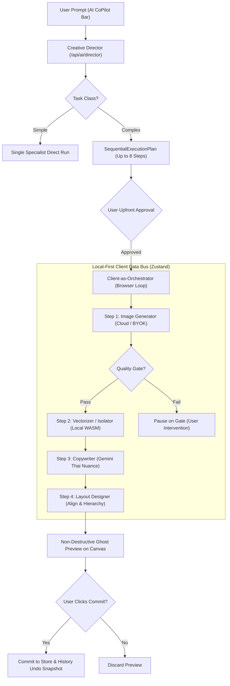

# Creative Director & AI Studio Pipeline — Architecture Specification

## 1. System Overview

ArtShift's **Creative Director & AI Studio Pipeline** is a local-first, multi-specialist creative orchestration system. It transforms complex human design intent into coordinated visual outputs across the Artwork canvas, incorporating generative AI, vectorization, typography, and publisher brand governance.

The canonical reasoning surface is the **ArtShift Orchestrator** (`/api/ai/director`).
“Creative Director” remains a source-compatible name for the model alias and older
imports, while the deprecated Design Agent route delegates to this same planning
and review implementation. There is one remote brain and one tool protocol.

---

## 2. Core Subsystems & Contracts

### 2.1 Client-Owned Session & Snapshot Store
- **File**: [`lib/ai/orchestration/sessionState.ts`](file:///root/ArtShift/lib/ai/orchestration/sessionState.ts)
- **Design Philosophy**: Server routes remain 100% stateless. The client stores turns, candidate variations, and Canonical Artifact snapshots.
- **Memory Optimization**: `summarizeArtworkObjects()` strips heavy image base64 and binary assets, storing only bounding boxes, layer ids, and text snippets (<5KB per turn).
- **Undo/Redo Alignment**: Each snapshot stores `historyIndex`, allowing native integration with the canvas history stack.

### 2.2 Sequential Execution Graph & Exception Gating
- **File**: [`lib/ai/orchestration/executionGraph.ts`](file:///root/ArtShift/lib/ai/orchestration/executionGraph.ts)
- **Pipeline Topology**: Strictly sequential linear pipeline (up to 8 steps) where any step references previous step outputs via `dependsOnStepId`.
- **Exception Gating**: `advancePlanStep()` evaluates step outputs against `qualityThreshold` (default 0.70). Drops below threshold transition the plan into `paused_on_gate` to allow user correction without losing completed step work.
- **Execution truth**: the runner uses real image, vectorizer, layout, copywriter and brand-kit seams. Unsupported specialists, missing dependencies, empty outputs and malformed step payloads pause the plan with an actionable error; it never returns sample URLs or fabricated artifacts.

### 2.3 Non-Destructive Canvas Ghost Overlay
- **File**: [`lib/renderer/ghostOverlay.ts`](file:///root/ArtShift/lib/renderer/ghostOverlay.ts)
- **Rendering Mechanism**: `drawGhostVariationOverlay()` paints candidate variations directly to the Canvas2D context with 85% alpha, violet dashed outlines (`#8b5cf6`), corner anchor markers, and pill badge tags.
- **State Decoupling**: Renders independently of `doc.slides.elements`, ensuring zero mutation to document state until user confirms.

### 2.4 Specialist-to-Model Capability Routing
- **File**: [`lib/ai/orchestration/creatingModelCatalog.ts`](file:///root/ArtShift/lib/ai/orchestration/creatingModelCatalog.ts)
- **Specialist Mapping**:
  - `image_generator` -> `IMAGE_DEFAULT` (Replicate `openai/gpt-image-2` / BYOK OpenAI)
  - `image_editor` -> `IMAGE_EDIT` (Replicate img2img / Local RMBG)
  - `vectorizer` -> `IMAGE_VECTOR` (`local-vtracer` WASM / Replicate `recraft-vectorize`)
  - `copywriter` -> `TEXT_COPYWRITER` (Google Gemini 2.0 Flash for Thai nuance / Claude 3.7)
  - `layout_designer` -> `LAYOUT_DESIGNER` (Claude 3.7 Sonnet / `alignElements()`)
  - `brand_stylist` -> `BRAND_STYLIST` (Publisher Brand Kit rules)

---

## 3. Prioritized Implementation Roadmap (Build Tickets)

| Ticket ID | Feature Area | Description | Priority | Estimated Complexity |
| :--- | :--- | :--- | :---: | :---: |
| **BUILD-01** | Client Store Slice | Integrate `sessionState.ts` into Zustand `lib/engine/store.ts` and bind to `AICoPilotBar.tsx` conversation timeline. | **P0** | 1-2 sessions |
| **BUILD-02** | Canvas Overlay Hook | Integrate `drawGhostVariationOverlay()` into `lib/renderer/canvas.ts` render loop, listening to `activeGhostVariationId`. | **P0** | 1 session |
| **BUILD-03** | Step Execution Engine | Implement client-side step runner loop in `turnOrchestrator.ts` executing `SequentialExecutionPlan` with `advancePlanStep()`. | **P1** | 2 sessions |
| **BUILD-04** | Specialist Prompts | Enhance `app/api/ai/director` system prompt to emit `SequentialExecutionPlan` for `complex` visual intents. | **P1** | 1 session |
| **BUILD-05** | UI Staging Tray | Render candidate variation cards in `AICoPilotBar` with hover-to-ghost-preview and one-click Commit button. | **P2** | 1 session |
