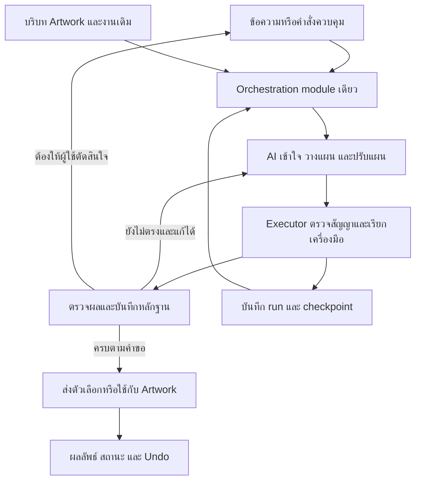

# ArtShift AI orchestration: development plan

สถานะ: แผนเสนอสำหรับพัฒนา ยังไม่ได้ implement ตามเอกสารนี้

ตรวจโค้ดอ้างอิงวันที่ 2026-09-08 ที่ commit `653216f` โดยอ่าน execution paths และ UI; ยังไม่ได้ทดสอบประสบการณ์ผ่าน browser หรือคุณภาพจาก provider จริงในรอบจัดทำแผนนี้

เป้าหมายคือให้ผู้ใช้บอกผลลัพธ์ที่ต้องการ แล้ว AI เข้าใจบริบท ลงมือ ตรวจ แก้ปัญหา และส่งมอบงานที่ใช้ต่อได้ โดยให้คุณภาพและประสิทธิภาพมาก่อนค่าใช้จ่าย

## 1. ประสบการณ์ที่ต้องส่งมอบ

ผู้ใช้ควรรู้สามอย่างเสมอ: AI เข้าใจว่าจะทำอะไร ตอนนี้งานถึงไหน และตนต้องตัดสินใจอะไรหรือไม่

| สถานการณ์ | พฤติกรรมเป้าหมาย |
|---|---|
| คำสั่งชัดเจนและย้อนกลับได้ | ทำภายในขอบเขตที่ผู้ใช้สั่ง พร้อมผลลัพธ์และ Undo |
| มีข้อมูลพอ แต่รายละเอียดเสริมยังไม่ครบ | ใช้ค่าเริ่มต้นที่เหมาะสม แจ้งสมมติฐานสั้น ๆ และเริ่มงาน |
| ขาดข้อมูลที่เปลี่ยนผลลัพธ์สำคัญ เช่น ไม่รู้ว่าต้องแก้ภาพใด | ถามเฉพาะข้อมูลที่จำเป็น โดยให้เห็นเป้าหมายที่กำลังอ้างถึง |
| งานหลายขั้นตอน | แสดงแผนสั้นที่บอกผลลัพธ์และสิ่งที่จะเปลี่ยน อนุมัติครั้งเดียวสำหรับขอบเขตนั้น |
| ผู้ใช้แก้คำสั่งระหว่างทำ | รับข้อความทันที ระบุว่าเป็นการเปลี่ยนงานเดิมหรือเริ่มงานใหม่ เก็บส่วนที่ยังใช้ได้ |
| เครื่องมือขัดข้อง | ติดตามหรือแก้ขั้นตอนที่มีปัญหา แจ้งเมื่อสถานะเปลี่ยนหรือจำเป็นต้องให้ผู้ใช้ช่วย |
| งานได้บางส่วน | แสดงชิ้นงานที่ได้จริง จำนวนที่ยังขาด และสถานะการทำต่อ |
| งานเสร็จ | แสดงผลงานจริง สิ่งที่เปลี่ยน และข้อจำกัดที่ยังมี โดยทุกข้อความตรงกับบันทึกการทำงาน |

ตัวอย่างหลักสำหรับพัฒนาและตรวจรับ:

1. ผู้ใช้: “สร้างภาพกาแฟ 3 แบบ โทนอุ่น ไม่ใส่ตัวหนังสือ”
2. AI สรุป brief สั้น ๆ และสร้างตัวเลือกที่มีหมายเลขคงที่ ไม่ต้องถามเรื่องที่ระบุแล้ว
3. ระบบแสดงภาพจริงครบตามจำนวน และตรวจเงื่อนไขที่ระบุ
4. ผู้ใช้: “แบบ 2 ให้แก้วเล็กลง ที่เหลือเหมือนเดิม”
5. AI ใช้ภาพหมายเลข 2 เป็นฐาน สร้าง revision เฉพาะภาพนั้น และรักษาเงื่อนไขเดิม
6. ผู้ใช้เลือกนำภาพไปใช้ ระบบวางครั้งเดียวบน Artwork ที่ถูกต้อง และย้อนกลับได้ด้วย Undo หนึ่งครั้ง
7. หากสร้างไม่ครบ ระบบเก็บภาพที่สำเร็จแล้ว และทำเฉพาะส่วนที่เหลือต่อ

คำว่า “ทำงานจนจบ” หมายถึงติดตามงานจนส่งมอบ หรือถึงสถานะที่ต้องให้ผู้ใช้ตัดสินใจพร้อมเหตุผลและผลงานที่กู้ไว้ ไม่ใช่ retry โดยไม่มีขอบเขต

## 2. ช่องว่างที่พบในโค้ดปัจจุบัน

มีจุดวางแผนหลักร่วมกันแล้ว แต่ยังไม่มี lifecycle เดียวครอบคลุมทุกทางเข้าและทุกเครื่องมือ

| ปัญหาที่พบ | ผลต่อผู้ใช้ | หลักฐาน |
|---|---|---|
| Client ตรวจ design plan โดยไม่ส่ง designContext และคืนค่าดิบแทนค่าที่ parser ปรับแล้ว | แผนที่ถูกต้องอาจถูกปฏิเสธก่อนแสดงผล | [creativeDirectorClient.ts](/opt/artshift/lib/ai/orchestration/creativeDirectorClient.ts:85) |
| Sequential specialists ให้ reviewScore เท่ากับ 1; ไม่มีคะแนนก็ถือว่า 1 | สถานะผ่านตรวจไม่มีหลักฐานเพียงพอ | [turnOrchestrator.ts](/opt/artshift/lib/ai/orchestration/turnOrchestrator.ts:322), [executionGraph.ts](/opt/artshift/lib/ai/orchestration/executionGraph.ts:228) |
| Reviewer ล้มเหลวแต่บันทึก director.reviewed เป็น passed | ความหมายของ “ตรวจแล้ว” ไม่ตรงกับสิ่งที่เกิดขึ้น | [imageTaskRunner.ts](/opt/artshift/lib/ai/orchestration/imageTaskRunner.ts:325) |
| ภาพถูกวางแล้ว แต่ UI อ่าน fileId/url ที่ไม่มีในผลลัพธ์และแสดงเป็น staged อีกครั้ง | Preview อาจใช้ไม่ได้ และการนำไปใช้อาจซ้ำ | [AICoPilotBar.tsx](/opt/artshift/components/AI/AICoPilotBar.tsx:624) |
| Resume เริ่มจาก currentStepIndex โดยไม่ป้องกัน completed plan | กดทำต่อหรือกดซ้ำอาจทำขั้นตอนสุดท้ายซ้ำ | [turnOrchestrator.ts](/opt/artshift/lib/ai/orchestration/turnOrchestrator.ts:511) |
| ข้อความระหว่าง busy ถูกปฏิเสธ; ข้อความถัดจาก clarification ถูกประกอบกับ brief เดิมเสมอ | เปลี่ยนใจหรือสั่งหยุดผ่านบทสนทนาได้ไม่ต่อเนื่อง | [AICoPilotBar.tsx](/opt/artshift/components/AI/AICoPilotBar.tsx:314) |
| Chat ใช้ component state; session store ยังไม่เชื่อม production และไม่ persist | เปิดใหม่แล้วบริบทและงานค้างไม่ต่อเนื่อง | [AICoPilotBar.tsx](/opt/artshift/components/AI/AICoPilotBar.tsx:72), [sessionState.ts](/opt/artshift/lib/ai/orchestration/sessionState.ts:168) |
| มี prediction handle บางกรณี แต่ client ยัง resume ไม่ได้ | เน็ตหลุดแล้วติดตามงานเดิมต่อไม่ได้อย่างครบถ้วน | [imageTaskRunner.ts](/opt/artshift/lib/ai/orchestration/imageTaskRunner.ts:463) |

ยังมีทางเข้าที่ทำงานต่างกัน: main chat มีทั้ง single และ batch path; image modal ใช้ dispatcher ที่ส่งบริบทไม่ครบเท่ากัน และ legacy copy fallback ยังมีข้อความโปรโมชั่นตายตัว ต้องย้ายเข้าสัญญาการทำงานเดียวกัน

## 3. โครงสร้างเป้าหมาย

ใช้ Orchestration module เดียวเป็นเจ้าของวงจรงาน โดย UI ส่งข้อความหรือคำสั่งควบคุม และรับสถานะกับผลลัพธ์กลับมา การเลือกเครื่องมือ การติดตามงาน การตรวจ และการแก้อยู่ภายใน module นี้

AI orchestrator รับผิดชอบ intent, แผน, การอ่านผลเครื่องมือ และการตัดสินใจแก้ไข ใช้ reasoning policy ชุดเดียวตลอดงาน เครื่องมือภาพ ข้อความ layout และลบพื้นหลังเป็น specialist adapters ที่มีหน้าที่เฉพาะ Executor บังคับเงื่อนไขการทำงานโดยไม่เพิ่มสมองสนทนาอีกชุด

Interface ที่ UI ควรเรียนรู้มีเพียงสามส่วน:

- `submitTurn`: ส่งข้อความพร้อม session และบริบทอ้างอิง คืน turn/run ที่ติดตามได้
- `controlRun`: อนุมัติ เปลี่ยน brief พัก ยกเลิก ทำต่อ เลือกผลลัพธ์ หรือนำไปใช้ โดยอ้างถึง run/plan version
- `observeSession`: รับ snapshot และ events สำหรับแสดงบทสนทนา สถานะ และผลงาน รวมถึงเชื่อมต่อใหม่จาก event cursor

ชื่อและรูปแบบ TypeScript เป็นข้อเสนอ ยังไม่ใช่ interface ที่มีอยู่แล้ว การเปลี่ยน transport ภายหลังต้องไม่ทำให้ UI กลับมารับผิดชอบ execution loop

บันทึกสำคัญภายใน module:

| ข้อมูล | สิ่งที่ต้องเก็บ |
|---|---|
| Brief | เป้าหมาย จำนวน ขนาด ข้อความที่ต้องตรง สิ่งห้ามเปลี่ยน สมมติฐาน และคำถามที่ยังขาด |
| Target | docId, artworkId, object IDs, revision และ reference asset IDs ที่ตรึงไว้เมื่อเริ่มงาน |
| Run | runId, planVersion, approval scope, steps, dependency, attempt และสถานะ |
| Artifact | ID คงที่, asset reference ที่เปิดได้จริง, version, parent artifact, preview และสถานะ staged/applied |
| Evidence | ผลตรวจแต่ละเกณฑ์ ผู้ตรวจ ข้อจำกัด และสถานะ passed/failed/not_checked/unavailable |
| Receipt | ขั้นตอนที่เกิดจริง ผลลัพธ์ที่ได้ การใช้กับ Artwork และ undo reference |

เก็บ brief และ artifact references อย่างมีโครงสร้าง ควบคู่ประวัติข้อความ เพื่อให้ “แบบ 2”, “เหมือนเดิม”, “ทำต่อ” และ “อย่าเปลี่ยนโลโก้” ไม่ขึ้นกับการเดาจากข้อความล่าสุดเท่านั้น Context summary ต้องรักษา hard constraints และ pending decisions เมื่อย่อประวัติ

## 4. ลำดับพัฒนาและเกณฑ์ตรวจรับ

เริ่มเก็บ baseline และชุดสถานการณ์ตั้งแต่ช่วงแรก แต่ปล่อยความสามารถเพิ่มเฉพาะเมื่อผ่านเกณฑ์ของช่วงนั้น กำหนดระยะเวลาปฏิทินหลังแตกงานและทราบกำลังทีม

| ช่วง | งานพัฒนา | สิ่งที่ผู้ใช้จะสัมผัสได้ | เกณฑ์ผ่าน |
|---|---|---|---|
| M0 — ผลลัพธ์ตรงความจริง | แก้ response validation, เอาคะแนนผ่านจำลองออก, แยก reviewer unavailable, ป้องกัน execute ซ้ำ, ตรวจจำนวนและรายงาน cancel/partial จาก receipts | ไม่บอกว่าตรวจผ่านทั้งที่ไม่ได้ตรวจ และไม่สร้างงานซ้ำจากการกดทำต่อ | Regression สำหรับ valid plan, reviewer outage, repeat resume และ cancellation หลังสำเร็จบางส่วนผ่าน |
| M1 — เส้นทางครบหนึ่งงาน | รวม chat/modal เข้าสู่ module เดียว; common tool contract; ตรึง target; แยกสร้าง artifact ออกจาก commit; cards ใช้ asset จริง; preview/apply/undo | สร้าง 3 แบบ เลือก แก้ และใช้ภาพได้ต่อเนื่อง | Journey หลักครบทุกขั้น; จำนวนไม่หาย; กด Apply ซ้ำไม่เพิ่ม Object; เปลี่ยน Artwork ระหว่างรอไม่วางผิดที่ |
| M2 — สนทนาต่อเนื่อง | ผูก session store กับ UI; persist brief/artifacts/turns; แยก follow-up, correction, new task, status, pause/cancel/resume; approval scope และข้อความสรุปแผน | ถามน้อยลง จำแบบที่เลือก และรับคำสั่งระหว่างทำได้ | ทดสอบแก้ brief ระหว่างทำ, เปลี่ยนเรื่องขณะรอคำตอบ, เปิดแชตใหม่ และแก้ accepted artifact หลัง refresh |
| M3 — ติดตามและแก้จนจบ | Durable cloud runs, provider job handles, checkpoints, reconciliation, bounded repair loop และป้องกันหลาย executor ทำ step เดียวกัน | เน็ตหลุดกลับมาต่องานเดิม; ขั้นที่พังได้รับการแก้โดยรักษางานที่สำเร็จแล้ว | ตัดการเชื่อมต่อหลัง provider รับงานแล้วพบผลเดิม; ไม่มี generation ซ้ำโดยไม่ทราบผลเดิม; repair เฉพาะ step และ dependents ที่ต้องเปลี่ยน |
| M4 — คุณภาพงานออกแบบและขยายเครื่องมือ | ตรวจ Artwork ที่ render จริง, text/brand/layout criteria, เพิ่ม specialist ทีละตัว และประเมินคุณภาพบทสนทนากับผลงานจริง | งานตรง brief และแก้เฉพาะจุดได้ดีขึ้นอย่างวัดผลได้ | ผ่าน quality benchmark ของความสามารถที่เปิดใช้ พร้อมหลักฐานผลงานและผลประเมินโดยคน |

M0–M1 เป็นชุดพัฒนาแรก มี progress card และผลลัพธ์ที่ตรวจได้ตั้งแต่ช่วงนี้ M2–M3 ต่อบน run/artifact contract เดิม M4 เริ่มออกแบบเกณฑ์ตั้งแต่ M0 และขยายคุณภาพหลัง execution เชื่อถือได้

Backlog ที่เริ่มลงมือได้ตามลำดับ:

1. **ORCH-01:** เพิ่ม regression ของ design-plan transport แล้วใช้ context จริงและ normalized response
2. **ORCH-02:** เปลี่ยน review contract เป็นหลักฐานรายเกณฑ์; unavailable ต้องไม่กลายเป็น passed
3. **ORCH-03:** บังคับ lifecycle/approval version และ no-op สำหรับ completed/replayed control commands
4. **ORCH-04:** Artifact contract ร่วมกัน; แก้ภาพที่วางแล้วแต่แสดงว่า staged; แยก prepare กับ commit
5. **ORCH-05:** ย้าย routing/execution ออกจาก UI และ legacy dispatcher ให้ทุก entry point ใช้ module เดียว
6. **ORCH-06:** เชื่อม structured session, artifact lineage และการเปลี่ยน intent ระหว่างทำ
7. **ORCH-07:** Persist run/checkpoint/job handles; reconnect และ reconcile ผลเดิม
8. **ORCH-08:** ส่ง error + unmet criteria + completed artifacts กลับ orchestrator เพื่อวาง repair ที่เปลี่ยนสาเหตุจริง
9. **ORCH-09:** ตรวจภาพและ Artwork หลัง render พร้อมประเมินความตรง brief และความสวยงามแยกกัน
10. **ORCH-10:** เปิดใช้กับกลุ่มทดสอบ เก็บผลจริง และขยาย specialist เมื่อผ่านเกณฑ์เดียวกัน

## 5. กติกาที่ทำให้ความฉลาดแปลงเป็น UX ที่ดี

**ถามเมื่อจำเป็นและรักษาการอนุมัติเดิม:** ไม่ถามซ้ำสิ่งที่ brief หรือ Artwork บอกได้ งานง่ายทำตามคำสั่งพร้อม Undo; งานหลายขั้นแสดงแผนที่เข้าใจได้และขออนุมัติครั้งเดียว การแก้ทางเทคนิคภายในขอบเขตเดิมทำต่อได้ หากเปลี่ยนเป้าหมายหรือสิ่งที่จะกระทบจริงจึงเสนอแผนฉบับใหม่ Cloud consent ต้องเก็บตามขอบเขตที่อนุญาตและเพิกถอนได้ แทน browser confirm ทุก turn

**ควบคุมได้ระหว่างทำ:** แยกช่องรับคำสั่งจากสถานะ busy ของ generation ปุ่มควบคุมส่ง typed action โดยตรง ส่วนข้อความธรรมชาติ resolve เข้าสู่ action เดียวกัน ถ้าตีความได้หลาย run ให้ชี้ run ที่เกี่ยวข้องก่อนเปลี่ยน ไม่ทิ้งข้อความเงียบ ๆ และไม่ถือทุกข้อความเป็น brief ใหม่

**แก้ตามสาเหตุ:** ปัญหาชั่วคราวก่อนส่งงานใช้ retry แบบหน่วงเวลา; ถ้าส่งแล้วแต่ไม่รู้ผลให้ติดตาม job เดิม; ถ้าผลงานไม่ตรง brief ให้แก้ prompt/เครื่องมือ/ขั้นตอนที่ผิด; ถ้า credentials หรือข้อมูลจำเป็นขาด ให้บอกสิ่งที่ผู้ใช้ต้องทำโดยเก็บงานที่สำเร็จไว้ ตั้งเพดาน attempt/เวลาเพื่อป้องกันวงจรค้าง และแสดงทางเลือกที่ใช้ต่อได้เมื่อถึงเพดาน

**รักษา target และ version:** เปลี่ยน Artwork หรือแก้ Object ระหว่างรอไม่ควรทำให้ผลหายหรือถูกใช้ผิดที่ เก็บ artifact แล้วตรวจความขัดแย้งก่อน commit ถ้าต้องวางใหม่ให้ปรับแผนการวางโดยไม่สร้างภาพเดิมซ้ำ ผลจาก brief version เก่าที่มาถึงช้าต้องไม่ทับฉบับใหม่

**แสดงสถานะที่มีความหมาย:** ใช้ card เดียวต่อ run เช่น “กำลังสร้างแบบที่ 2 จาก 3”, “พบข้อความเกินมา กำลังแก้เฉพาะภาพนี้”, “ได้แล้ว 2 แบบ กำลังติดตามอีก 1 แบบ” ให้ชื่อโมเดลและ log เป็นรายละเอียดเปิดดูเพิ่มได้ ไม่ใช้เปอร์เซ็นต์หรือเวลาเสร็จที่ไม่มีข้อมูลรองรับ

**ผลลัพธ์มีสองโหมดชัดเจน:** งานขอตัวเลือกส่ง staged candidates จนกว่าผู้ใช้เลือก งานแก้ตรงตามคำสั่งอาจใช้กับ Artwork หลังผ่านเงื่อนไขและขอบเขตที่อนุมัติ แต่ต้องมี receipt และ Undo เสมอ ห้ามใช้ภาพเดียวกันเป็นทั้ง staged และ applied โดย UI ไม่รู้

## 6. งานยาวและการเก็บสถานะ

ข้อเสนอระยะแรกคง Artwork และ conversation UX ไว้ฝั่ง client พร้อม persistence ส่วน cloud execution มี durable run records ที่ server/worker ใช้ทำงานต่อได้ ไม่เก็บสถานะสำคัญไว้ใน memory ของ request process เพียงอย่างเดียว

ข้อเสนอนี้ขยายจาก [ADR เดิม](/opt/artshift/docs/adr/0001-creative-director-multi-turn-pipeline.md) ที่กำหนด client-only orchestration และไม่มี session database ต้องบันทึกการเปลี่ยน decision เมื่อเริ่ม M3 การจัดทำแผนนี้ยังไม่ได้แก้ ADR ที่มีสถานะ Accepted

Server routes ยังทำงานแบบ stateless ได้โดยอ่าน/เขียน durable records; ใช้ orchestration policy เดียวกับ client execution และมีเจ้าของ step ที่ชัดเจน ไม่เพิ่ม orchestrator แข่งกัน งาน local ที่ต้องใช้ browser ต้อง checkpoint และรอ browser กลับมา หรือมี adapter ฝั่ง server ที่ผ่านการตรวจรับแล้วก่อนรับประกันว่าทำต่อเมื่อปิดแท็บได้

การส่ง provider request ต้องมี attempt record ก่อนส่ง และบันทึก job handle ทันทีที่ได้รับ หากการเชื่อมต่อหายก่อนรับ handle ให้ reconcile ด้วยความสามารถที่ provider รองรับ หากตรวจสอบไม่ได้ให้คงสถานะ outcome unknown และไม่ส่งซ้ำอัตโนมัติ การป้องกันซ้ำฝั่งเราไม่ใช่คำรับประกัน exactly-once ของ provider ทุกตัว

## 7. การตรวจคุณภาพและวัดผล

ความสำเร็จต้องมี artifact จริงครบตามจำนวน และมีผลตรวจ hard constraints ครบก่อนแสดงว่า verified ส่วนการ apply ต้องมี receipt ว่า Artwork เปลี่ยนจริง การทำ artifact เสร็จและการนำไปใช้เป็นคนละสถานะ

ตรวจทั้งโครงสร้างและงานที่มองเห็น: ข้อความต้องตรง, target ถูกต้อง, จำนวนครบ, ขนาดถูก, logo/สิ่งห้ามเปลี่ยนยังอยู่, ภาพเปิดได้, layout ไม่มีข้อความล้น และผล render ตรงกับผลที่ผู้ใช้เห็น ใช้การตรวจแบบ deterministic กับข้อเท็จจริงที่ตรวจได้ และ visual review กับคุณสมบัติภาพ พร้อมระบุข้อจำกัดของผู้ตรวจ การมีคะแนนจาก AI อย่างเดียวไม่เพียงพอยืนยันทุกเงื่อนไข

สำหรับข้อความที่ต้องเป๊ะและแก้ต่อได้ ควรใช้ text Objects ใน Artwork ตามความสามารถที่มี มากกว่าฝากข้อความสำคัญทั้งหมดไว้ในภาพ raster ตัว orchestrator ต้องเลือกเครื่องมือจากความสามารถที่รองรับจริง ห้ามทดแทนคำสั่งด้วยข้อความโปรโมชั่นหรือ operation ที่ไม่เกี่ยวข้อง

ชุดประเมินเริ่มต้นเสนอ 60 บทสนทนา: งานเดี่ยว 20, งานหลาย turn 20, คำสั่งกำกวม/เปลี่ยนใจ 10, และสถานการณ์ความผิดพลาด 10 ใช้ regression แบบควบคุมผลเครื่องมือสำหรับ lifecycle และงาน provider จริงสำหรับคุณภาพ ไม่รวมสองประเภทเป็นคะแนนเดียว

| ตัวชี้วัด | วิธีใช้ |
|---|---|
| Task success | จำนวนงานที่ครบ brief และใช้ผลงานได้จริง หารด้วยงานที่ทดสอบในขอบเขตที่รองรับ; เป้าหมายเริ่มต้นเสนอ ≥90% หลังเก็บ baseline |
| False completion / duplicate effects / wrong target | ต้องไม่พบในชุด regression ก่อนปล่อยแต่ละช่วง; ติดตามเหตุการณ์จริงหลังเปิดใช้ ไม่อ้างว่าไม่มีโอกาสเกิดนอกชุดทดสอบ |
| Constraint retention | ตรวจว่าข้อความ จำนวน สิ่งห้ามเปลี่ยน และ artifact ที่อ้างถึงคงอยู่ข้าม turn |
| Recovery success | วัดแยกตามชนิดความล้มเหลวที่กู้ได้ และตรวจว่าไม่ทำ completed steps ซ้ำ |
| Unnecessary intervention | จำนวนครั้งที่ผู้ใช้ต้องย้ำคำสั่ง ตอบคำถามเดิม หรือสั่งทำต่อทั้งที่ระบบทำเองได้ |
| Latency | วัดเวลารับคำสั่ง, ถึงสถานะที่มีความหมาย, ถึง preview แรก และถึงผลที่ตรวจแล้ว ใช้ p50/p95 แยกชนิดงาน |
| Design quality | ให้คนประเมินความตรง brief ความอ่านง่าย และความเหมาะสมของภาพ โดยดูผลงานจริงและ rubric เดียวกัน |

ตัวเลขข้างต้นเป็นเป้าหมายเสนอ ยังไม่มี baseline ในรอบนี้ เริ่ม instrumentation ตั้งแต่ M0 และกำหนด latency SLO หลังวัด ไม่ถือว่าการตอบรับเร็วแปลว่าส่งมอบเร็วหรือคุณภาพดี

สถานการณ์บังคับก่อนเปิดใช้: reviewer ใช้ไม่ได้, provider ส่งงานสำเร็จแต่ client หลุด, refresh ระหว่างทำ, กด Apply/Resume ซ้ำ, เปลี่ยน Artwork ระหว่างรอ, ยกเลิกหลังได้บางภาพ, ส่งคำแก้ระหว่างทำ, เปลี่ยนเรื่องขณะรอ clarification, และ late result จาก brief เก่า

## 8. แนวทางย้ายระบบ

นำของเดิมที่ดีมาใช้: การตรวจ references/target ใน image runner, atomic commit และ Undo ใน applyAiPlan, batch counts, progress events และ session schema โดยแก้ช่องว่างก่อนใช้ร่วมกัน

ย้าย entry point ทีละตัวเข้าสู่ module เดียวหลังผ่าน contract tests อย่า dual-run เครื่องมือที่มี side effects เพื่อเปรียบเทียบ หากต้องเปรียบเทียบ planner ให้เป็น dry run ที่ไม่เรียกสร้างภาพหรือแก้ Artwork ปิดความสามารถที่ยังไม่ผ่านเกณฑ์อย่างตรงไปตรงมา แล้วถอด legacy routing เมื่อไม่มี production callers

ชุดส่งมอบแรกที่แนะนำคือ M0–M1: ผลลัพธ์ตรงความจริง และ journey สร้าง/เลือก/แก้/ใช้/Undo ครบจากแชตเดียว หลังจากนั้นจึงต่อความจำ การกู้คืนงานยาว และ specialist เพิ่มเติมบน lifecycle เดิม
