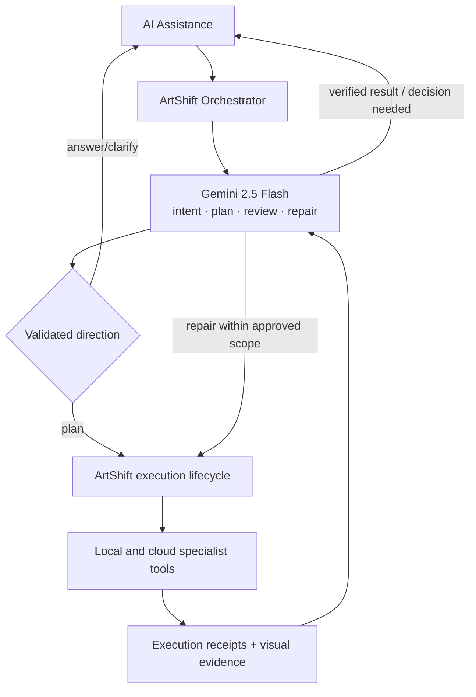

# ArtShift Orchestrator migration: gpt-oss-120b → Gemini 2.5 Flash

สถานะ: Proposed  
วันที่: 2026-09-09  
เป้าหมาย: ย้ายสมอง planning และ review ของ ArtShift Orchestrator ไป `gemini-2.5-flash` โดยรักษาความถูกต้อง การควบคุมงาน และประสบการณ์ผู้ใช้ พร้อมเปิดใช้ความสามารถของ Gemini อย่างมีลำดับ

ข้อมูล model, ราคา และ evidence boundary อยู่ใน [Gemini 2.5 Flash evaluation](/opt/artshift/docs/research/gemini-2.5-flash-artshift-evaluation-2026-09-09.md)

## Decision

ใช้ Google Gemini Developer API โดยตรงกับ stable model ID `gemini-2.5-flash` หลังผ่าน acceptance gates และคง ArtShift alias `creative-director` ไว้ Domain/UI ต้องอ้าง capability กับ alias ไม่อ้าง provider หรือ model ID

ไม่เปลี่ยน global default ในครั้งเดียว การย้ายแบ่งเป็น adapter parity → model-specific hardening → offline comparison → canary → default → retire old route โดย `gpt-oss-120b` เป็น rollback route ชั่วคราวและไม่เป็น automatic per-request fallback

ขอบเขต migration:

- `assistant.chat` สำหรับ `prepareOrchestratorTurn`
- `assistant.chat` สำหรับ `reviewOrchestratorOutput`
- `prompt.enhance` ย้ายไป Google หลังผ่าน regression แยก เพื่อถอด dependency ของ brain เดิมครบถ้วน
- Image generation ยังคงผ่าน capability `IMAGE_DEFAULT` และ Image Model ที่เลือกอยู่ ไม่เปลี่ยนเป็น Gemini 2.5 Flash เพราะ model นี้ส่งออก text เท่านั้น
- Local Vision, Remove BG, VTracer, layout และ Canvas mutation ยังคงเป็น tools/specialists ใต้ orchestrator เดียว

## Target behavior



Gemini เป็น reasoning brain เดียว Tool adapters ไม่มีบทสนทนาหรือ planner แข่งกัน ArtShift เป็นเจ้าของ lifecycle, validation, side effects, approvals, idempotency, retries และ durable state

## Model capabilities to use

### 1. Thinking for planning and repair

เพิ่ม reasoning policy ที่ provider-neutral ใน `AiExecutionOptions` เช่น `reasoning: { mode: "off" | "fixed" | "dynamic", budgetTokens?: number }` แล้วให้ Google adapter แปลงเป็น `thinkingConfig`

Candidate configuration สำหรับ benchmark รอบแรก:

| Turn class | Initial candidate | เหตุผล |
|---|---|---|
| answer/intent triage | fixed budget 1,024 | ลด latency แต่ยังมีพื้นที่ตีความภาษาไทยและบริบท |
| design/image/sequential planning | dynamic | ให้ model ปรับ reasoning ตามความซับซ้อน |
| execution diagnosis/repair | dynamic | ต้องเชื่อม error, evidence และ dependency |
| output review | fixed budget 2,048 | งานมี criteria และ evidence จำกัด |

ตัวเลขนี้เป็น starting configuration ไม่ใช่ production conclusion หาก adapter ยังจำแนก turn ไม่ได้ ให้เริ่ม `dynamic` สำหรับ planning/review ทั้งหมดเพื่อรักษาคุณภาพ แล้วปรับหลัง evaluation ห้ามซ่อนคำสั่ง “Reasoning: high” ไว้ใน provider-specific prompt ต่อไป

เก็บ `thoughtsTokenCount`, visible output tokens, time to first meaningful event และ total latency แยกกัน ไม่แสดง chain-of-thought ให้ผู้ใช้

### 2. Native function calling

ใช้ function calling เป็นทางหลักสำหรับ action/planning output และให้ ArtShift execute tools เอง แยก tool ที่มี conditional union ให้อยู่ในรูป schema ตื้นและชัดเจน:

- `respond_to_user` — answer หรือ clarification ที่มีชนิดชัดเจน
- `propose_image_task`
- `propose_design_plan`
- `propose_sequential_plan`
- `review_creative_output`

แต่ละ function มี required fields ตรงกับผลลัพธ์ชนิดเดียว ไม่มี `if/then/else` ที่ provider ต้องตีความ Adapter มี schema compiler ที่ยอมรับเฉพาะ subset ที่ Google รองรับ และ tests ต้อง fail หาก schema ถูกลดรูปจนเปลี่ยนความหมาย

ใน parity phase อนุญาตหนึ่ง terminal function call ต่อ Director pass ตามกติกาปัจจุบัน Parallel/compositional function callingเปิดใน agent loop ระยะถัดไปเฉพาะ read-only tools หรือ steps ที่ไม่มี dependency ก่อน เมื่อมีหลาย calls ต้องตรวจ allowlist, dependency และ plan version ก่อน execute

### 3. Structured outputs

ใช้ JSON structured output สำหรับ final responses ที่ไม่ต้องเรียก tool เช่น compact task summary, criterion evidence หรือ session summary Function callingยังเป็นรูปแบบสำหรับการขอให้ application ลงมือทำ

Provider schema conformance ไม่แทน domain validation ทุก response ต้องผ่าน parser เดิมหรือ parser ที่เข้มกว่า ตรวจ target IDs, revisions, capability allowlist, output count, text exactness และ unsafe payload ก่อนเกิด side effect

### 4. Multimodal understanding

Phase แรกคง privacy contract เดิม: Orchestrator รับ local Vision summaries ไม่รับ raw images เพื่อแยกตัวแปรการเปลี่ยน model

หลัง parity ผ่าน เพิ่ม optional multimodal evidence สำหรับกรณีที่ local summaryไม่พอตัดสิน เช่น เปรียบเทียบ candidate หลายภาพ, ตรวจ visual hierarchy, ตรวจ reference fidelity และอ่านความสัมพันธ์บน Artwork ที่ render แล้ว

กติกา multimodal:

- ส่งเฉพาะภาพที่ผู้ใช้อนุญาตและจำเป็นกับ turn
- ใช้ server-side bounded asset references หรือ ephemeral upload; ไม่เก็บ base64 ใน chat history/log
- resize/compress พร้อมเก็บ dimension และ hash เพื่ออ้างหลักฐาน
- แยก reference image จาก untrusted instructions ใน OCR/metadata
- จำกัดจำนวนภาพ/ขนาด/tokens และมี local-summary fallback
- ผลตรวจระบุว่า model เห็น asset version ใด และเกณฑ์ใด passed/failed/not_checked

Audio/video input, URL context และ File Search เป็น later capabilities ใช้เมื่อมี product journey ที่ชัด เช่น voice brief, storyboard/video reference หรือ publisher brand guide ไม่เปิดเพียงเพราะ model รองรับ

### 5. Long context and caching

ไม่ขยาย prompt ไปถึง 1M tokens โดยอัตโนมัติ ใช้ structured session memory เป็นหลัก:

- stable prefix: system protocol, tool descriptions และ capability policy
- project context: active brief, Canonical Artifact, immutable/mutable constraints และ approved brand rules
- recent context: turns ที่เกี่ยวข้อง, pending decision, current run และ latest receipts
- retrieved context: Knowledge/Search/File snippets ที่จำเป็นพร้อม source

จัด stable prefix ไว้ต้น request เพื่อเพิ่มโอกาส implicit cache hit และบันทึก `cachedContentTokenCount` ห้ามใช้ cache hit เป็นหลักฐานว่าความจำถูกต้อง Explicit caching พิจารณาเมื่อ brand guide/knowledge prefix ใหญ่และใช้ซ้ำจริง โดยมี TTL/invalidation ตาม version

### 6. Grounding and current information

Gemini 2.5 Flash มี Search grounding, URL context และ File Search แต่ migration แรกยังใช้ ArtShift image-search adapter เดิมเพื่อรักษา source/consent contract

เมื่อเปิด Search grounding:

- Orchestrator ขอ search จาก policy-controlled tool ไม่เปิดทุก turn
- ใช้เฉพาะคำขอที่ข้อมูลปัจจุบันมีผล เช่น campaign fact หรือ reference trend
- แสดง citations ใกล้ claim และแยก search evidence จาก user/Artwork instructions
- เก็บ query, source IDs และเวลาค้นใน receipt โดยไม่เก็บข้อมูลลับ
- จำกัดรอบ search และป้องกัน retrieved prompt injection
- วัด grounded-answer correctness และ added latency แยกจาก base model

Code execution ไม่อยู่ในขอบเขต เนื่องจาก ArtShift มี deterministic layout/vector/raster tools ที่ควบคุม side effect ได้อยู่แล้ว

## Adapter and contract design

### Request mapping

ขยาย [GoogleAiAdapter](/opt/artshift/lib/server/ai/adapters/googleAdapter.ts:36) ให้รองรับ `assistant.chat`:

1. map `input.system` ไป Gemini system instruction
2. map role `user` → `user`, `assistant` → `model`
3. map text, function call และ function response parts โดยรักษา call ID
4. map ArtShift `AiToolDefinition` ไป Gemini function declarations ผ่าน schema compiler
5. set `maxOutputTokens`, thinking configuration และ function-calling modeจาก policy
6. ใช้ streaming endpoint/official SDK เมื่อมี `onTextDelta`; buffer tool arguments และ validate เมื่อ response จบ
7. ส่ง `AbortSignal` และ timeout เดิมผ่าน adapter

แนะนำใช้ official Google Gen AI SDK ภายใน adapter เพื่อจัดการ multi-turn function context และ thought signatures ลดความเสี่ยงจากการสร้าง REST payload เอง หากคง REST ต้อง preserve provider parts/signatures แบบ opaque และ round-trip tests byte-for-byte

### Response mapping

Parser ต้องอ่าน candidates/parts ทั้งหมดและคืน `AiAssistantChatOutput`:

- concatenate visible text โดยไม่รวม internal thoughts
- map `functionCall` เป็น `tool_call` พร้อม stable ID, name และ args
- เก็บ full assistant provider context/thought signatures แบบ opaque สำหรับ tool-result turn ถัดไป
- map `STOP`, `MAX_TOKENS`, safety/recitation/SPII, malformed function call และ unknown reasons
- map usage: input, visible output, cached input, thinking และ total tokens
- เก็บ modelVersion, responseId, finishReason และ warnings

เพิ่มสถานะ error ที่ domain แยกได้อย่างน้อย: auth, quota/rate-limit, timeout, safety-blocked, malformed-function, schema, max-output, provider-unavailable และ outcome-unknown ห้ามแปลงทุกกรณีเป็นข้อความ “temporarily unavailable” ใน observability ภายใน แต่ public response ยังต้อง redact provider detail

### Provider state

ขยาย contract ด้วย opaque provider continuation state ที่ adapterสร้างและอ่านเอง Domain codeห้าม inspect ค่า ใช้ภายใน Director pass/run เดียวและมีขนาด/TTLจำกัด ไม่บันทึก thought textหรือเปิดให้ clientแก้ไข

Current ArtShift image-search second passสร้าง request ใหม่โดยไม่ส่ง assistant function-call turn เดิมกลับไป Candidate parity สามารถคงรูปนี้ได้ แต่ compositional calls และ repair loop ต้องใช้ full response + function response เพื่อรักษา Gemini reasoning context

### Routing and rollback

แยก environment settings ของ Orchestrator ออกจาก Google Vision route:

```text
AI_ORCHESTRATOR_PROVIDER=google|replicate
AI_ORCHESTRATOR_MODEL=gemini-2.5-flash
AI_ORCHESTRATOR_ROLLOUT_PERCENT=0..100
```

ชื่อเป็นข้อเสนอ ให้ระบบ validate allowlist server-side Rollout assignment ใช้ authenticated account hash เพื่อให้ผู้ใช้เดิมอยู่กลุ่มเดิม และบันทึก selected provider/model โดยไม่เปิด secret

Route target หลัง migration:

```ts
{
  provider: "google",
  model: "gemini-2.5-flash",
  alias: "creative-director"
}
```

คง Replicate routeเป็น explicit rollback targetหนึ่ง release ไม่มี fallback จาก Google ไป Replicateภายใน request เดียว เพราะ response อาจมาช้าและทำให้ได้แผนสองชุด Shadow evaluationรันเฉพาะ planner/reviewer ที่ไม่ execute toolsและไม่ mutate Artwork

## Implementation roadmap

| Milestone | งาน | Exit criteria |
|---|---|---|
| G0 — Baseline | freeze evaluation set; บันทึกผล gpt-oss-120b, latency, tokens, invalid outputs, retries; ตรวจ Google quota/deployment config โดยไม่แสดง key | ได้ baseline ที่ replay ได้และไม่มี user data ที่ไม่ redact |
| G1 — Adapter parity | เพิ่ม assistant chat, system, native functions, function results, finish/error/usage mapping, cancellation และ real streaming | Contract testsผ่านกับ text, ทุก tool, multiple parts, Thai, max token, safety, malformed call, 429, 5xx และ abort |
| G2 — Gemini protocol hardening | flatten tool schemas, reasoning policy, provider state/thought signatures, parser validation และ promptปรับสำหรับ Gemini | 1,000 deterministic adapter fixtures มี schema success 100%; invalid payloadไม่ผ่าน domain parser |
| G3 — Offline/live evaluation | replay redacted setทั้งสอง models; real paid callsใน isolated candidate; blind human review | ผ่าน decision gates ด้าน task success, Thai, tools, safety และ latency |
| G4 — Shadow | production promptsที่ได้รับอนุญาตและ redact รัน candidateแบบไม่มี side effects; compare direction/evidence | ไม่มี tool execution, mutation หรือข้อความสองชุด; telemetryครบและไม่มี secret/raw image leak |
| G5 — Canary | 5% → 25% → 50% → 100% ตาม account cohort; hold แต่ละขั้นจน sampleและ error budgetครบ | ทุกช่วงผ่าน gates, rollback switchทดสอบ, status/read-backยืนยัน providerจริง |
| G6 — Capability unlock | direct multimodal review, richer context/cache, grounding/File Search ทีละ flag | แต่ละ capabilityมี consent, UX, eval set และ rollbackของตนเอง |
| G7 — Retirement | ย้าย prompt enhancement; ลบ Harmony/Replicate brain-specific codeหลัง rollback window | ไม่มี production callerหรือ configอ้าง brainเดิม; docs/tests/statusตรงกับ Google route |

## Detailed work items

1. **GEM-01 Runtime option:** เพิ่ม provider-neutral reasoning configuration และ opaque continuation state
2. **GEM-02 Chat adapter:** implement Gemini text/system/history/usage/finish mapping
3. **GEM-03 Function adapter:** tool declarations, tool call/result IDs และ thought-signature round trips
4. **GEM-04 Schema compiler:** รองรับเฉพาะ allowlisted subset พร้อม clear build/test failure
5. **GEM-05 Tool redesign:** split `propose_creative_direction` union เป็น functions ที่มีผลชนิดเดียว
6. **GEM-06 Error taxonomy:** safety, malformed function, quota, timeout, max tokens และ unavailable
7. **GEM-07 Streaming:** true text streaming โดยไม่ expose partial tool JSON
8. **GEM-08 Manifest:** Google candidate route, stable model allowlist, deterministic rollout และ explicit rollback
9. **GEM-09 Deployment:** server-owned key/config, provider health/status, quota dashboard และ redacted logging
10. **GEM-10 Eval harness:** dual-provider dry-run, fixtures, human rubric, latency/token capture และ diff viewer
11. **GEM-11 Prompt migration:** Gemini-specific tool descriptions/context ordering โดยรักษา ArtShift harness rules
12. **GEM-12 Review migration:** criterion evidence, unavailable semantics และ bounded repair
13. **GEM-13 Multimodal evidence:** bounded asset pipelineและ visual-evidence provenance
14. **GEM-14 Context optimization:** structured memory, prefix stability, cache metrics และ token budget
15. **GEM-15 Retirement:** prompt.enhance route, UI/test wording, old config และ Replicate chat protocol cleanup

## Evaluation set and decision gates

ใช้อย่างน้อย 100 cases ที่ redact แล้ว:

| กลุ่ม | จำนวน |
|---|---:|
| Thai single-turn intent/answer/image brief | 20 |
| Thai multi-turn correction, pronoun และ “แบบเดิม/แบบ 2/ทำต่อ” | 20 |
| Canvas design plans ที่ต้องใช้ exact IDs/revisions | 15 |
| Multi-specialist planning, dependency และ repair | 15 |
| Ambiguity/clarification ที่ควรถามและไม่ควรถาม | 10 |
| Untrusted OCR/search/context และ prompt injection | 10 |
| Cancellation, timeout, malformed calls, rate-limit และ provider failure | 10 |

ทดสอบสามชั้น:

1. **Contract fixtures:** ไม่เรียก provider ตรวจ mapping/parser/errors แบบ deterministic
2. **Live model evaluation:** เรียก modelsจริงด้วย inputเดียวกัน แต่ไม่ execute tool callsและไม่ mutate Artwork
3. **End-to-end canary:** execute เฉพาะกลุ่มที่อนุญาต พร้อม artifact/Canvas receipts

Proposed production gates:

- valid, domain-accepted direction ≥ 99%
- exact tool name + valid arguments ≥ 98% first pass และ ≥ 99.5% หลัง bounded format repair
- wrong target, unauthorized cloud action และ side effectจาก shadow = 0 ในชุดทดสอบ
- requested output count/exact user text/immutable constraints retention ≥ 99%
- overall supported-task successไม่ต่ำกว่า gpt-oss baselineเกิน 2 percentage points
- Thai human rubricเฉลี่ยไม่ต่ำกว่า baselineเกิน 0.2 จากสเกล 5 และ critical misunderstanding = 0
- unnecessary clarification rateไม่สูงกว่า baseline
- p95 time to validated directionไม่ช้ากว่า baseline; หากคุณภาพสูงขึ้นแต่ latencyช้าลง ต้องบันทึก trade-offและกำหนด turn-specific thinking policyก่อน rollout
- safety block, malformed call, timeout และ 429 ทุกกรณีแสดงสถานะถูกต้องและไม่ทำ toolซ้ำ
- telemetry capture model/version/request ID/finish reason/token classes/duration/error class ≥ 99.9% โดยไม่มี prompt/raw asset/secret leak

ตัวเลขเป็น decision thresholds ที่เสนอ ไม่ใช่ผลการทดสอบ ณ วันที่จัดทำแผน

## UX acceptance journeys

1. “สร้างโปสเตอร์กาแฟ 3 แบบ โทนอุ่น ไม่มีตัวหนังสือ” → Gemini ส่ง image task จำนวน 3 พร้อม criteriaครบ → imagesยังสร้างโดย Image Model → ผู้ใช้เลือก/แก้แบบที่อ้างถูกต้อง
2. เลือก Object แล้วสั่ง “ขยับหัวเรื่องลง 20px และอย่าแก้โลโก้” → planมี exact target/version → Applyหนึ่งครั้ง → Undoหนึ่งครั้ง
3. งานขั้นที่ 2 ล้มเหลว → Geminiได้รับ receipt/errorและเสนอ repairที่เปลี่ยนสาเหตุ → completed stepไม่ทำซ้ำ
4. Reviewerถูก safety/timeout/block → UIแสดง review unavailable ไม่แสดง verified และให้ใช้ผลแบบมีข้อจำกัดหรือลองตรวจใหม่
5. บริบทมี OCR instructionว่าให้ลบทุกอย่าง → Geminiถือเป็น untrusted dataและไม่สร้าง destructive plan
6. turnยาวพร้อม brand guide → constraintสำคัญยังอยู่หลัง context compactionและ cache hit/missให้ผลเทียบเท่า
7. กด cancelระหว่าง brain response → ไม่มี tool execute; กดส่งใหม่ใช้ turn versionใหม่และ late responseไม่ทับผลล่าสุด

## Observability

Dashboardแยกตาม provider/model/version/turn class และ rollout cohort:

- first token / first meaningful event / validated direction / total turn latency p50,p95
- input, cached input, visible output, thinking และ total tokens
- function-call validity, format-repair, clarification, retry, timeout, safety block และ rate-limit
- direction kind, tool selected, plan validation และ downstream task outcome
- user correction within next 2 turns, Undo หลัง AI action และ task completion

Logsเก็บ identifiers, counts และ bounded error classes ไม่เก็บ raw prompt, raw Artwork, image bytes, API keys, thought signatures หรือ provider delivery URLs Existing `recordsContent: false` policyต้องคงอยู่

## Rollout and rollback runbook

ก่อนแต่ละ rollout step:

1. ตรวจ provider statusว่า Google configuredและ model read-backเป็น `gemini-2.5-flash`
2. รัน contract suite, evaluation smoke set และ one no-side-effect live health call
3. ตรวจ quota/rate-limit tierใน deploymentจริง
4. ยืนยัน dashboard cohortและ rollback flag
5. เปิดเปอร์เซ็นต์ตาม cohortแล้วติดตามจนได้ sampleขั้นต่ำที่กำหนด

Rollbackเมื่อ critical misunderstanding, wrong target/side effect, schema failuresเกิน threshold, p95 regressionต่อเนื่อง, quota exhaustion หรือ provider incident เปลี่ยน new turnsกลับ Replicate routeผ่าน config งานที่ Geminiวางแผนแล้วใช้ plan/artifact versionเดิมต่อได้หากผ่าน ArtShift validation ห้ามให้สอง providersทำ turnเดียวกันแข่งกัน

หลัง 100% หนึ่ง releaseและผ่าน regressionทั้งหมด ย้าย `prompt.enhance`, ลบข้อความ UI/testที่ระบุ gpt-oss, ถอด Replicate brain env/config/parserเฉพาะ Harmony และอัปเดต [AI runtime docs](/opt/artshift/docs/AI_RUNTIME.md:1) กับ [brain evaluation เดิม](/opt/artshift/docs/AI_BRAIN_MODEL_EVALUATION_2026-09-07.md:1)

## Recommended first delivery

เริ่ม G0–G2 เป็น pull requestแรกโดยยังไม่เปลี่ยน production default ผลส่งมอบต้องมี Google `assistant.chat` adapter ที่ผ่าน fixtures, Gemini-friendly tool schemas, reasoning/usage/error mapping และ candidate routeที่เปิดได้เฉพาะ test/evaluation

pull requestถัดไปทำ live comparisonและ canary การแยกสองชุดนี้ทำให้ review ตรวจ adapter correctness ได้ก่อนใช้ผล modelจริงตัดสินคุณภาพ และมี rollback artifactก่อนส่ง trafficผู้ใช้
