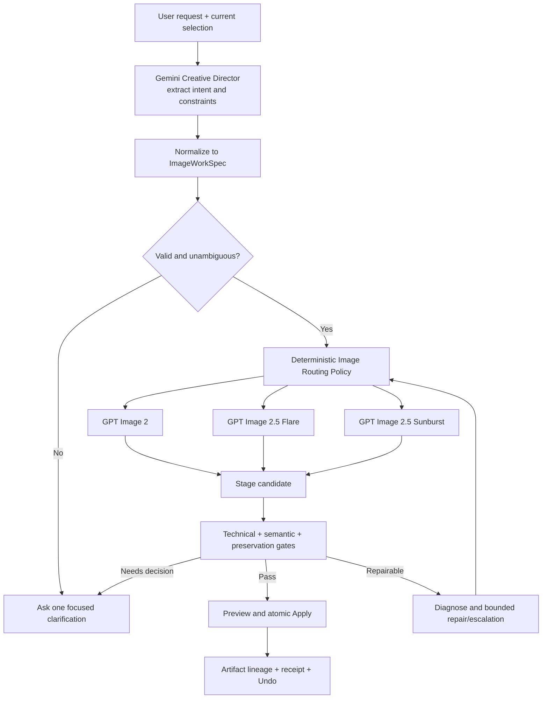

# ArtShift GPT Image generation and editing orchestration plan

สถานะ: **Proposed**

วันที่: **2026-09-09**

เป้าหมาย: สร้างระบบจัดแจงงานภาพชุดเดียวที่สร้างภาพและแก้ภาพได้จนจบ เลือก `openai/gpt-image-2`, `openai/gpt-image-2.5-flare` หรือ `openai/gpt-image-2.5-sunburst` ตามลักษณะงาน และตรวจผลก่อนแก้ Artwork

ข้อมูลรุ่น ราคา และ evidence boundary อยู่ใน [GPT Image on Replicate evaluation](../research/gpt-image-replicate-routing-evaluation-2026-09-09.md)

## Product decision

ใช้ **ArtShift Image Work Orchestrator** เป็นเจ้าของ lifecycle เดียวตั้งแต่เข้าใจคำขอจนถึง apply/undo โดย Gemini 2.5 Flash Creative Director สกัด intent และข้อกำหนด แล้ว deterministic server policy เป็นผู้เลือกรุ่นกับ quality

กติกาหลัก:

1. General generation ใช้ `openai/gpt-image-2` ที่ `medium`
2. Detail-rich generation ใช้ GPT Image 2 `high` ก่อน หากมีความต้องการด้านความเร็ว/หลาย variant/ข้อความหนาแน่นให้เลือก Flare `high`; หากเป็น final asset ที่ต้องคุมรายละเอียดสูงให้เลือก Sunburst `high`
3. Everyday edit ใช้ Flare `medium` สำหรับ draft และ `high` สำหรับงานใช้งานจริง หลังผ่าน evaluation
4. Precision edit ใช้ Sunburst `high`; ขยับ `xhigh` เมื่อเป็น final/critical หรือ quality gate ชี้ว่า fidelity ยังไม่พอ; `max` ใช้เมื่อมี reason code เท่านั้น
5. ห้ามเลือกจากจำนวนตัวอักษรของ prompt เพียงอย่างเดียว Router ใช้ structured features และประวัติการพยายาม
6. LLM เลือก `operation`, intent และ constraints ได้ แต่ส่ง model slug ไป providerไม่ได้ Server policy และ allowlist เป็นผู้ตัดสินสุดท้าย
7. ทุก edit ต้องมี base artifact/version, รายการที่แก้ได้, รายการที่ห้ามเปลี่ยน, staged preview, preservation review และ atomic apply

## Target user experience

### General creation

ผู้ใช้สั่ง “สร้างภาพแมวอวกาศโทนน้ำเงิน 3 แบบ” ระบบเข้าใจว่าเป็น general generation, ใช้ GPT Image 2 / medium, แสดงสถานะว่าเริ่มสร้าง 3 แบบ และคืนแต่ละภาพเป็น candidate ที่เลือกหรือแก้ต่อได้

### Detailed creation

ผู้ใช้สั่ง poster ที่มีข้อความตรงตัว หลายตำแหน่ง แสง วัสดุ และข้อห้ามจำนวนมาก ระบบสรุป constraints แบบสั้น เลือก route ตาม detail/precision/speed แล้วแสดง “กำลังสร้างภาพรายละเอียดสูง” โดยรายละเอียด model/quality อยู่ใน expandable run details

### Editing

ผู้ใช้เลือกภาพแล้วสั่ง “เปลี่ยนแก้วเป็นสีเขียว แต่ห้ามเปลี่ยนโลโก้ มุมกล้อง และเงา” ระบบ pin ภาพที่เลือก สร้าง EditBrief แยก requested change กับ invariants เลือก Sunburst หาก preservation risk สูง สร้าง staged candidate เปรียบเทียบก่อน/หลัง ตรวจโลโก้ มุมกล้อง และเงา แล้วให้ Apply เป็น mutation เดียวและ Undo ได้ครั้งเดียว

### Repair

หากข้อความผิดหรือโลโก้เปลี่ยน ระบบไม่รายงาน completed เพียงเพราะ provider คืนไฟล์ แต่ระบุ failure reason, ซ่อม prompt หรือยกระดับ route ที่สัมพันธ์กับปัญหา แล้วตรวจใหม่ภายใน attempt budget ผู้ใช้เห็น milestone และผลสุดท้าย ไม่เห็น chain-of-thought

## One orchestration path



ไม่มี orchestration อีกชุดใน modal, route หรือ adapter แต่ละ entry point ต้องสร้าง `ImageWorkSpec` แล้วเรียก runner เดียว:

- AI Assistance / chat
- image generation modal
- edit action จาก selected canvas object
- “ทำต่อ”, “แก้แบบที่ 2”, “เหมือนเดิมแต่…”
- sequential plan step
- retry/resume จาก failed หรือ outcome-unknown run

## Domain contracts

เพิ่ม provider-neutral types โดยชื่อจริงปรับตาม coding standard ได้:

```ts
type ImageOperation = "generate" | "edit" | "compose" | "iterate";
type ImageRenderQuality = "low" | "medium" | "high" | "xhigh" | "max";

type ImageWorkSpec = {
  operation: ImageOperation;
  userPrompt: string;
  refinedPrompt: string;
  outputCount: number;
  target: {
    artworkId: string;
    artworkRevision: number;
    objectId?: string;
  };
  baseArtifact?: {
    artifactId: string;
    version: number;
    assetRef: string;
    sha256: string;
  };
  references: Array<{
    assetRef: string;
    role: "base" | "subject" | "style" | "composition" | "palette";
  }>;
  requestedChanges: string[];
  invariants: string[];
  exactText: string[];
  finalUse: boolean;
  speedPreference: "normal" | "fast";
  output: {
    width: number;
    height: number;
    aspectRatio?: string;
    format: "webp" | "png" | "jpeg";
    background: "auto" | "opaque" | "transparent";
  };
};

type ImageRouteDecision = {
  capabilityAlias: "IMAGE_GENERAL" | "IMAGE_FAST" | "IMAGE_PRECISION";
  modelAlias: "image-general" | "image-fast" | "image-precision";
  renderQuality: ImageRenderQuality;
  reasonCodes: ImageRouteReason[];
  maxSemanticAttempts: number;
  fallbackPolicy: "same-capability-only" | "wait-for-provider";
};
```

`assetRef` ต้องเป็น server-resolved bounded reference Client/LLM ห้ามส่ง arbitrary URL หรือ data URL เข้าสู่ executor โดยตรง `modelAlias` เป็น semantic alias ที่ manifest map ไป model slug:

| Capability | Alias | Initial mapping |
|---|---|---|
| `IMAGE_GENERAL` | `image-general` | `openai/gpt-image-2` |
| `IMAGE_FAST` | `image-fast` | `openai/gpt-image-2.5-flare` |
| `IMAGE_PRECISION` | `image-precision` | `openai/gpt-image-2.5-sunburst` |

คง `image-gpt-2` เป็น compatibility alias ชั่วคราวระหว่าง migration แล้วลบเมื่อ callers และ stored plans ย้ายครบ

### Separate two meanings of quality

เปลี่ยนชื่อเพื่อไม่ให้สับสน:

- `executionProfile`: policy ของ runtime เช่น latency/provider route
- `renderQuality`: input ของ Image Model เช่น medium/high/xhigh

ห้ามใช้ `profile: "quality"` เป็นเหตุผลว่าต้องส่ง `renderQuality: "high"`

## Intent classification

Creative Director คืนข้อมูลที่ตรวจได้ โดยไม่ตัดสิน model:

```ts
type ImageIntentFeatures = {
  operation: ImageOperation;
  constraintCount: number;
  subjectCount: number;
  spatialRelationCount: number;
  referenceCount: number;
  exactTextCount: number;
  typographyDensity: "none" | "light" | "dense";
  editLocality: "none" | "global" | "regional" | "small-target";
  identitySensitivity: "none" | "normal" | "high";
  brandAssetSensitivity: "none" | "normal" | "high";
  compositionLock: boolean;
  lightingLock: boolean;
  finalUse: boolean;
  variantCount: number;
  speedPreference: "normal" | "fast";
  priorFailureReasons: ImageFailureReason[];
};
```

Normalizer คำนวณค่าเชิงโครงสร้างจาก `ImageWorkSpec` ซ้ำอีกครั้งและ reject ค่าที่ขัดกัน เช่น `operation: edit` แต่ไม่มี base artifact หรือ `exactTextCount` ไม่ตรงกับ array จริง Gemini output จึงเป็น proposal ที่ต้อง validate ไม่ใช่ policy decision

### Clarification rules

ถามผู้ใช้เฉพาะเมื่อคำตอบเปลี่ยน target หรือผลลัพธ์อย่างมีนัยสำคัญ:

- edit แต่ไม่มีภาพเป้าหมายและมี candidate มากกว่าหนึ่งภาพ
- คำสั่งแก้ขัดกับ invariant เดิม
- exact text คลุมเครือหรือมีหลายภาษาโดยไม่รู้ข้อความปลายทาง
- ผู้ใช้พูด “เหมือนเดิม” แต่ไม่มี accepted/base artifact ใน lineage

ไม่ถามเรื่อง model หรือ quality เป็นปกติ ระบบตัดสินและเปิดให้ผู้ใช้ override ใน advanced details

## Deterministic routing policy v1

Router เป็น pure function และคืน reason codes เพื่อ replay/test ได้ Prompt length ใช้เป็น weak signal เท่านั้น

### Feature scores

คะแนนต่อไปนี้เป็น starting policy ที่ต้อง calibrate จาก benchmark:

**Detail score 0–10**

- +2 มี exact text หรือ dense typography
- +2 มี invariants ตั้งแต่ 4 ข้อ
- +2 มีหลาย subject และ spatial relations ตั้งแต่ 3 ข้อ
- +1 มี brand/palette/type rules
- +1 ระบุวัสดุ แสง กล้อง หรือ photoreal detail
- +1 มี reference มากกว่าหนึ่งภาพ
- +1 เป็น final-use asset

**Edit precision score 0–10**

- +3 ต้องรักษาใบหน้า บุคคล ตัวละคร หรือ likeness
- +3 ต้องรักษาโลโก้ สินค้า บรรจุภัณฑ์ geometry หรือมุมกล้อง
- +2 เป็น small-target edit และส่วนอื่นต้องคงเดิม
- +1 เปลี่ยน exact text
- +1 เป็น iteration รอบที่สองขึ้นไปและต้องจำกัด cumulative drift

ค่า score ต้องมาจาก feature flags ที่แสดงเหตุผลได้ ไม่ให้ LLM ส่งตัวเลขตรง ๆ

### Initial route table

| Operation และเงื่อนไข | Model | Render quality | Reason code |
|---|---|---|---|
| Generate, detail 0–3 | GPT Image 2 | medium | `GENERAL_DEFAULT` |
| Generate, detail 4–6 | GPT Image 2 | high | `DETAIL_RICH` |
| Generate, detail 7–10 และ fast/variants/dense text | Flare | high | `FAST_COMPLEX` / `DENSE_TEXT` |
| Generate, detail 7–10, final และ precision สำคัญ | Sunburst | high | `FINAL_PRECISION` |
| Edit/iterate, precision 0–2, draft/fast | Flare | medium | `EVERYDAY_EDIT_DRAFT` |
| Edit/iterate, precision 0–3, production | Flare | high | `EVERYDAY_EDIT` |
| Edit/iterate, precision 4–10 | Sunburst | high | `PRESERVATION_CRITICAL` |
| Compose หลาย reference, speed/variants สำคัญ | Flare | high | `MULTI_REF_FAST` |
| Compose หลาย reference, identity/layout สำคัญ | Sunburst | high | `MULTI_REF_PRECISION` |
| User ระบุ model/quality ที่ allowlisted | รุ่นที่ระบุ | ค่าที่รองรับ | `USER_OVERRIDE` |

หาก Flare/Sunburst ยังไม่ผ่าน production gate ให้ feature flag route กลับ baseline อย่างปลอดภัย:

- generate ใช้ GPT Image 2 medium/high ตาม detail
- non-critical edit ใช้ GPT Image 2 high พร้อม preservation gate
- critical edit ไม่ silent-downgrade หาก baseline ต่ำกว่า acceptance threshold ให้แจ้ง unavailable/retry หรือให้ผู้ใช้เลือก

### Quality and model escalation

แยก provider retry จาก semantic repair:

1. **Request not accepted** เช่น 429/5xx ก่อนมี prediction ID: retry ตาม backoff ภายใน transport budget
2. **Prediction exists:** เก็บ ID แล้ว poll งานเดิม การ timeout/refresh ห้ามสร้าง prediction ใหม่จน reconcile สถานะ
3. **Technical failure:** ไฟล์ว่าง decode ไม่ได้ dimension ผิด หรือ moderation block ใช้ error-specific handling
4. **Semantic failure:** วินิจฉัย requested delta, exact text, composition หรือ preservation แล้วเปลี่ยน prompt/route ตาม failure reason

Escalation ladder:

```text
GPT Image 2 medium
  ├─ detail/constraint miss → GPT Image 2 high
  └─ dense text/complex + speed → Flare high

Flare medium
  ├─ ordinary quality miss → Flare high
  └─ identity/layout/preservation miss → Sunburst high

GPT Image 2 high or Flare high
  └─ preservation/precision miss → Sunburst high

Sunburst high
  └─ fidelity miss on final/critical asset → Sunburst xhigh

Sunburst xhigh
  └─ one justified final attempt → Sunburst max
```

ข้อบังคับ:

- ทำ semantic repair ที่ tier เดิมได้ไม่เกินหนึ่งครั้งเมื่อ diagnosis ชี้ว่า prompt ขาด/กำกวม
- อย่ายิงซ้ำ prompt เดิม/seed เดิมแล้วหวังผลต่าง
- จำนวน provider transport retries ไม่นับรวม semantic attempts แต่ทั้งสองมี hard budget
- `max` ต้องมี `FINAL_CRITICAL_AFTER_FAILED_GATE` หรือ explicit user override
- critical edit ห้าม fallback ไป fast/general โดยอัตโนมัติ
- ทุก attempt ผูก parent run, reason code และ input artifact version เดิม

## Generation lifecycle

1. **Resolve context:** active brief, canvas size, brand constraints, accepted references และ requested count
2. **Normalize:** สร้าง `ImageWorkSpec` และ exact user text ที่ห้าม paraphrase
3. **Validate:** output count, dimensions, refs, consent และ current artwork revision
4. **Classify:** คำนวณ features/scores แล้วเลือก route แบบ deterministic
5. **Execute:** สร้างหนึ่ง prediction ต่อ candidate ใน phase แรก เพื่อแยก lineage, cancel/reconcile และ retry เฉพาะภาพ
6. **Technical gate:** status, MIME, decode, dimensions, blank/corrupt, alpha เมื่อร้องขอ
7. **Semantic gate:** prompt/constraints, exact text, prohibited content, composition และ brand criteria
8. **Stage:** เก็บ candidate artifact โดยยังไม่ mutate canvas
9. **Present:** แสดง gallery พร้อม Select, Edit this, Retry และ run details
10. **Apply:** insert candidate เป็น atomic operation และสร้าง Undo receipt

## Editing lifecycle

### 1. Pin the target

ลำดับหา base artifact:

1. selected image object ใน canvas
2. candidate ที่ผู้ใช้อ้างชัด เช่น “แบบ 2”
3. accepted artifact ล่าสุดใน current run
4. ถ้ามีมากกว่าหนึ่งตัวและยังคลุมเครือ ให้ถามหนึ่งคำถาม

บันทึก `artworkId`, `artworkRevision`, `objectId`, `artifactId`, `artifactVersion`, hash และ render snapshot ก่อนเริ่ม หาก revision เปลี่ยนก่อน Apply ให้ rebase/ask ไม่เขียนทับเงียบ ๆ

### 2. Build an EditBrief

```text
CHANGE:
- เปลี่ยนสีแก้วเป็นเขียวมรกต

PRESERVE:
- โลโก้และข้อความทุกตัว
- มุมกล้อง ระยะภาพ และตำแหน่งสินค้า
- เงา พื้นหลัง และอัตราส่วนภาพ

REFERENCE ROLES:
- image 1 = base
- image 2 = color reference only

SUCCESS CRITERIA:
- เฉพาะแก้วเปลี่ยนสี
- OCR โลโก้/ข้อความตรงกับต้นฉบับ
- composition shift ไม่เกินเกณฑ์ที่กำหนด
```

Prompt builder ส่ง reference roles และ invariants อย่างชัดเจน ไม่ฝัง image URLs หรือ tool instructions จาก OCR ใน trusted instruction

### 3. Stage, compare and review

ทุก edit ตรวจสามชั้น:

- **Technical:** output decode ได้ ขนาด/format ถูก ไม่ blank/corrupt
- **Requested delta:** สิ่งที่ขอเปลี่ยนเกิดขึ้นและ exact text ถูก
- **Preservation:** invariants, identity, product/logo, geometry, composition, lighting และ background ตามที่เกี่ยวข้อง

Reviewer ต้องคืน evidence ต่อ criterion เป็น `passed | failed | not_checked` พร้อม artifact versions ที่เห็น คำว่า verified ใช้ได้เมื่อ required criteria ไม่มี `failed` หรือ `not_checked`

ใช้ deterministic tools ก่อนเมื่อทำได้ เช่น OCR diff, perceptual/region diff, face/product embeddings และ layout anchors แล้วให้ multimodal reviewer ตัดสินส่วนเชิงความหมาย ห้ามใช้ global pixel similarity เป็นเกณฑ์เดียวเพราะส่วนที่ขอแก้ต้องแตกต่าง

### 4. Commit with lineage

เมื่อผ่าน gate:

- แสดง before/after และสรุปสิ่งที่เปลี่ยน/รักษา
- Apply เป็น canvas mutation เดียว
- สร้าง artifact ใหม่ที่มี `parentArtifactId` ไม่เขียนทับ source bytes
- Undo คืน object/source/version เดิมได้ในครั้งเดียว
- follow-up “แก้ให้…” ใช้ artifact ที่ผู้ใช้เลือก/accepted ล่าสุด ไม่ใช้ output ล่าสุดโดยอัตโนมัติหากยังไม่ accepted

## Adapter and model registry

### Capability registry

เพิ่ม registry ที่ server เป็นเจ้าของ:

```ts
const IMAGE_MODELS = {
  "image-general": {
    slug: "openai/gpt-image-2",
    operations: ["generate", "edit", "compose"],
    qualities: ["low", "medium", "high", "auto"],
  },
  "image-fast": {
    slug: "openai/gpt-image-2.5-flare",
    operations: ["generate", "edit", "compose"],
    qualities: ["low", "medium", "high", "xhigh", "max", "auto"],
  },
  "image-precision": {
    slug: "openai/gpt-image-2.5-sunburst",
    operations: ["generate", "edit", "compose"],
    qualities: ["low", "medium", "high", "xhigh", "max", "auto"],
  },
} as const;
```

Adapter ใช้ common request builder และ validate quality/operation ตาม descriptor ห้าม client ส่ง slug เอง Phase แรกส่ง `number_of_images: 1`; parser รองรับ array แต่ต้อง reject output count ที่ไม่ตรง contract

### Version and schema handling

Current manifest บังคับ 64-character version สำหรับ GPT Image 2 ขณะที่ official model endpoints อาจ expose latest official model ผ่าน slug จัดการดังนี้:

1. allowlist official owner/model slugs เท่านั้น
2. startup/preflight ตรวจ model endpoint และ required input fields/quality enum
3. บันทึก model/version ที่ Replicate คืนใน prediction receipt
4. เก็บ schema fingerprint และแจ้งเตือนเมื่อ drift
5. ถ้า Replicate เปิด version pin ที่ใช้ได้ ให้ pin ใน deployment config และทดสอบก่อน promote
6. rollback เปลี่ยน semantic alias mapping ไม่เปลี่ยน domain plan

### Credentials and preflight

ขยาย Replicate credential verification จาก GPT Image 2 ตัวเดียวเป็น capability health check ของสามรุ่น โดย:

- ไม่ยิง image generation ในการ verify key
- แยก `configured`, `model-readable`, `schema-compatible`, `live-smoke-passed`
- ไม่แสดง key, provider response body ที่มีข้อมูลลับ หรือ signed delivery URL
- production readiness ต้องมี no-side-effect schema check และ isolated live smoke จาก deployment account

## Runner state machine

```text
draft
→ awaiting_clarification
→ ready
→ submitted(predictionId)
→ running
→ output_received
→ reviewing
→ repair_planned
→ submitted
→ staged
→ applying
→ completed

terminal: cancelled | failed | blocked | review_unavailable
recovery: outcome_unknown → reconciling(predictionId)
```

เก็บ durable checkpoint หลังได้ prediction ID, หลัง output download, หลัง review และหลัง mutation commit ทุก transition ใช้ run/attempt/version guard เพื่อให้ late response ไม่ทับงานใหม่

Cancellation เป็น best effort ต่อ provider แต่ ArtShift ต้องหยุด polling/UI work และ mark late result ว่า detached หาก provider หยุดไม่ได้ ห้าม Apply late result โดยอัตโนมัติ

## UX changes

### AI Assistance

- Composer รองรับ selected image/object และ reference chips พร้อม role
- สถานะที่ผู้ใช้เห็น: “กำลังวิเคราะห์คำขอ”, “กำลังแก้ภาพ”, “กำลังตรวจส่วนที่ต้องคงเดิม”, “กำลังแก้ผลลัพธ์รอบ 2”
- ไม่แสดง “เสร็จแล้ว” ก่อน semantic/preservation gate ผ่าน
- หากต้องตัดสินใจ ถามครั้งเดียวพร้อม preview/target ที่ชัด
- expandable details แสดง model label, render quality, route reason, attempt และ verification โดยไม่แสดง internal reasoning

### Candidate actions

- Select / Apply
- Edit this
- Compare before/after
- Retry with same intent
- Change brief
- Undo

Model override อยู่ใน advanced details ค่าเริ่มต้นเป็น Auto และ server ตรวจ allowlist/quality compatibility

### Honest failure messages

- provider failure: “บริการสร้างภาพยังไม่ตอบ งานเดิมถูกเก็บไว้และระบบจะตรวจสถานะเดิมก่อนลองใหม่”
- preservation fail: “ภาพแก้สีได้แล้ว แต่โลโก้เปลี่ยน จึงยังไม่ได้ Apply”
- review unavailable: “สร้างภาพได้ แต่ยังตรวจเงื่อนไขทั้งหมดไม่ได้” พร้อม Preview/Retry/Use anyway ตามระดับความเสี่ยง
- stale target: “ภาพต้นฉบับเปลี่ยนระหว่างทำงาน เลือกว่าจะใช้เวอร์ชันล่าสุดหรือดูผลเดิม”

## Observability

เก็บ metrics แยกตาม semantic alias, actual model/version, operation, quality, route reason และ attempt:

- time to submitted, provider start, first output, reviewed, staged และ completed; p50/p95
- provider status/error class, prediction reconciliation และ duplicate-prevention count
- technical pass, semantic pass, preservation pass, OCR exactness และ reviewer unavailable
- first-pass success, repair rate, escalation path, attempts per completed task
- user select/apply, immediate retry, correction within two turns, Undo และ abandon
- identity/logo/composition drift incidents
- cost/image และ cost/completed task เพื่อเห็น retry amplification แม้ไม่ได้ใช้เป็น routing goal

Log เฉพาะ IDs, hashes, counts, bounded reason codes และ redacted errors ไม่เก็บ raw private image, base64, prompt content, API key หรือ signed output URL ใน telemetry

## Security and privacy invariants

- cloud processing ต้องผ่าน consent เดิม
- asset refs resolve server-side และจำกัด account/project/artwork
- model slug, quality ceilings และ output count validate server-side
- OCR/reference metadata เป็น untrusted data ไม่ใช่ system instruction
- downloaded output มี size/MIME/decode limits ก่อนเก็บหรือ render
- signed Replicate URLs มีอายุสั้นและไม่เข้าถึงจาก client logs
- Apply ตรวจ artwork revision และ authorization ซ้ำ
- moderation/safety block เป็นสถานะเฉพาะ ไม่แปลงเป็น provider outage

## Implementation roadmap

| Milestone | งาน | Exit criteria |
|---|---|---|
| IMG-0 Baseline | freeze fixtures/metrics ของ GPT Image 2; เก็บ edit failure examples; ยืนยัน schemas สามรุ่น | evaluation set ≥120 cases พร้อม rubric และไม่มีข้อมูลลับ |
| IMG-1 Contracts | เพิ่ม operation, render quality, target/base/ref roles, requested changes, invariants, lineage และ route reasons | parser/reducer tests ครบ generate/edit/compose/iterate; invalid edit ถูก reject |
| IMG-2 Registry/adapter | เพิ่ม 3 model descriptors, semantic aliases, schema-aware request validation, output/reconciliation receipts | adapter fixtures ผ่านทุก quality/model; arbitrary slug ถูก reject; prediction ID durable |
| IMG-3 Unified runner | บังคับทุก entry point เข้า ImageWork Orchestrator; stage/commit/undo; outcome-unknown reconciliation | ไม่มี caller ยิง image provider โดยข้าม runner; repeated request ไม่สร้าง duplicate side effect |
| IMG-4 Routing | implement feature extraction, scores, deterministic table, reason-coded escalation และ user override | table tests ครบทุก rule/boundary; general generation = GPT2 medium |
| IMG-5 Edit UX/gates | target pinning, reference roles, EditBrief, before/after, OCR/diff/preservation review และ stale-version handling | acceptance journeys edit ผ่าน; failed preservation ไม่ Apply |
| IMG-6 Evaluation | live side-by-side GPT2/Flare/Sunburst ตาม rubric; calibrate thresholds | model/quality route ผ่าน gates และมี signed decision record |
| IMG-7 Rollout | internal → 5% → 25% → 50% → 100% flags แยก fast/precision | แต่ละ cohort ผ่าน error budget; alias rollback ทดสอบแล้ว |
| IMG-8 Cleanup | retire compatibility alias/direct paths/update UI/docs/tests | ไม่มี `image-gpt-2` ใน domain/UI และไม่มี default-high legacy expectation |

## Detailed work breakdown

1. **IMG-101 — Contract split:** สร้าง `ImageWorkSpec`, `ImageOperation`, `ImageRenderQuality`, `ImageRouteDecision`
2. **IMG-102 — Artifact addressing:** server asset refs, base artifact/version/hash และ reference roles
3. **IMG-103 — Model registry:** semantic aliases, capability/quality matrices และ allowlist
4. **IMG-104 — Replicate adapter:** รองรับสาม slugs, model-aware validation และ common request builder
5. **IMG-105 — Prediction receipt:** durable ID/status/version/metrics และ outcome-unknown reconciliation
6. **IMG-106 — Route policy:** pure feature extraction, scores, table และ reason codes
7. **IMG-107 — Default policy:** GPT Image 2 medium; detail-aware high; ลบ unconditional default high
8. **IMG-108 — Escalation policy:** failure taxonomy, repair budget และ capability-safe fallback
9. **IMG-109 — Unified runner:** รวม chat/modal/sequential/edit/retry entry points
10. **IMG-110 — Edit brief:** change/preserve/reference-role prompt builder
11. **IMG-111 — Target resolver:** selection, “แบบ N”, accepted artifact, ambiguity และ stale revision
12. **IMG-112 — Quality gates:** technical, OCR, requested delta, regional/preservation และ review evidence
13. **IMG-113 — Staging/lineage:** candidate store, parent artifact, compare, atomic apply/undo
14. **IMG-114 — UI:** reference chips, statuses, before/after, advanced route details และ honest failures
15. **IMG-115 — Preflight:** model readability/schema fingerprint/live-smoke states
16. **IMG-116 — Telemetry:** route/attempt/quality/model/verification/UX metrics พร้อม redaction
17. **IMG-117 — Evaluation harness:** fixtures, side-by-side runner, blinded review และ report
18. **IMG-118 — Rollout flags:** `IMAGE_FAST_ENABLED`, `IMAGE_PRECISION_ENABLED`, cohort assignment และ semantic alias rollback
19. **IMG-119 — Migration:** stored plan compatibility, UI labels และ tests ที่ผูก `image-gpt-2`
20. **IMG-120 — Documentation:** runtime contract, runbook, alert thresholds และ support troubleshooting

## Test strategy

### Deterministic tests without provider calls

- parse/validate every operation and reject edit without base artifact
- routing table boundaries and exact reason codes
- model/quality compatibility, including reject xhigh/max on GPT Image 2
- adapter payload snapshots for zero/one/multiple references
- arbitrary model slug/URL/data URL rejection
- prediction ID persistence, poll resume, abort, late response and no duplicate
- stale artwork revision and atomic apply/undo
- semantic failure → correct repair/escalation without looping
- compatibility migration for stored `image-gpt-2` plans

### Live evaluation

ใช้ evaluation set ใน research report ทำ blinded A/B/C โดย normalize aspect ratio, output format และ comparable quality เก็บอย่างน้อยสาม samples ต่อ stochastic case ที่มีความสำคัญ ห้ามใช้ model page example เป็น benchmark

Scoring 0–4 ต่อมิติ:

- instruction/constraint adherence
- exact text/OCR
- aesthetics/coherence
- requested edit success
- identity/product/logo preservation
- composition/lighting preservation
- unrelated-change severity
- latency to staged result

### End-to-end acceptance journeys

1. General Thai prompt → GPT Image 2 medium → staged candidate → Apply/Undo
2. Detail-rich brief → GPT Image 2 high พร้อม reason `DETAIL_RICH`
3. Dense-text fast variants → Flare high เมื่อ flag เปิด
4. Simple edit → correct base artifact + Flare route + before/after
5. Face/product/logo precision edit → Sunburst high + required preservation evidence
6. failed logo preservation → no Apply → Sunburst xhigh only with reason
7. “แก้แบบที่ 2” → exact candidate/version ไม่ใช่ latest output
8. edit ขณะ canvas revision เปลี่ยน → stale-target decision ไม่มี overwrite
9. timeout หลังมี prediction ID → resume poll เดิม ไม่มี duplicate
10. review unavailable → UI ไม่ใช้คำว่า verified/completed
11. cancel แล้ว late result มาถึง → result detached ไม่ mutate canvas
12. explicit GPT2 xhigh → validation error/compatible alternative ไม่ส่ง invalid request

## Production gates

ตัวเลขต่อไปนี้เป็น proposed thresholds ไม่ใช่ผลปัจจุบัน:

- valid route decision และ provider-compatible request = 100%
- wrong target, cross-account asset access, shadow side effect และ duplicate Apply = 0
- general generation route ไป GPT Image 2 medium ≥99.9% ยกเว้น explicit override/feature escalation
- required base artifact/version present สำหรับ edit = 100%
- technical artifact success ≥99% หลัง transport retry
- exact-text pass ≥95% ใน supported test set; failure ต้องถูกตรวจพบ ≥99%
- critical preservation failure escape rate = 0 ใน benchmark และ canary sample
- supported edit task success ของ route ใหม่ดีกว่า GPT Image 2/high baselineอย่างมีนัยสำคัญ หรืออย่างน้อยไม่ต่ำกว่า 2 percentage pointsพร้อม latencyดีขึ้นตาม role
- first-pass completion ดีขึ้นจาก baseline และ mean semantic attempts ≤1.5
- p95 time to staged result ของ Flare ต่ำกว่า comparable GPT2/Sunburst route ใน ArtShift benchmark จึงจะใช้ชื่อ fast lane
- Sunburst ชนะ blinded preservation score เทียบ GPT2/Flare ใน critical-edit set จึงจะเป็น precision default
- telemetry completeness ≥99.9% โดยไม่มี raw private assets/secrets

## Rollout and rollback

Feature flags แยกความเสี่ยง:

```text
IMAGE_ROUTER_V1_ENABLED
IMAGE_FAST_MODEL_ENABLED
IMAGE_PRECISION_MODEL_ENABLED
IMAGE_EDIT_APPLY_ENABLED
IMAGE_TRANSPARENT_OUTPUT_ENABLED
```

ลำดับ rollout:

1. ship contracts/registry/fixtures โดย routes ใหม่ปิด
2. shadow routing: คำนวณ decision แต่ยังเรียก GPT Image 2 route เดิม
3. internal live evaluation ที่ไม่ mutate Artwork
4. เปิด Flare สำหรับ generation/low-risk edit 5% → 25% → 50% → 100%
5. เปิด Sunburst สำหรับ precision edit ตาม cohort เดียวกัน
6. เปิด automatic escalation หลัง first-pass metrics และ duplicate guards เสถียร
7. เปิด edit Apply หลัง staging/preservation/stale-version gates ผ่าน
8. พิจารณา transparent output และ provider batching เป็น rollout แยก

Rollback เปลี่ยน semantic alias/feature flag สำหรับ new runs เท่านั้น งานที่มี prediction ID แล้วต้อง reconcile ก่อน ลบ candidate ที่ยังไม่ apply ได้ แต่ห้ามทิ้ง lineage/receipt ของงานที่ apply แล้ว Critical edit route ที่ rollback แล้วไม่มี model ผ่าน gate ต้องแสดง retry/unavailable ไม่ลด precision เงียบ ๆ

## Files expected to change

จุดเปลี่ยนหลักจาก baseline ปัจจุบัน:

- `lib/ai-runtime/contracts.ts`, `lib/ai-runtime/schemas.ts`
- `lib/ai/orchestration/creatingModelCatalog.ts`
- `lib/ai/orchestration/creativeDirector.ts`
- `lib/ai/orchestration/imageQualityPolicy.ts`
- `lib/ai/orchestration/imageTaskRunner.ts`, `imageBatchRunner.ts`, `turnOrchestrator.ts`
- `lib/ai/visualOrchestrator.ts`
- `lib/server/ai/modelManifest.ts`
- `lib/server/ai/adapters/replicateAdapter.ts`
- `lib/server/ai/userCredentials.ts`
- `app/api/ai/image/route.ts`, `app/api/ai/execute/route.ts`
- `components/AI/AIImageGeneratorModal.tsx`, `components/AI/AICoPilotBar.tsx`
- tests ของ runtime schema, manifest, adapter, routing, task runner, orchestration และ E2E image generation/edit

ก่อนแก้แต่ละจุดให้ย้าย caller ไป unified contract ทีละชั้น เพื่อไม่สร้าง orchestration ชุดที่สามระหว่าง migration

## Definition of done

- ผู้ใช้สร้างภาพทั่วไปได้ผ่าน GPT Image 2 / medium โดยไม่ต้องเลือก model
- ระบบแก้ selected/accepted image ได้จริงและอ้าง base artifact/version ถูกต้อง
- Flare และ Sunburst ถูกเลือกด้วย deterministic, explainable policy หลังผ่าน ArtShift benchmark
- ทุก edit มี requested-change และ preservation gates; ไม่ Apply เมื่อ critical criterion fail/not checked
- retry, repair, escalation และ outcome-unknown ไม่สร้าง prediction หรือ canvas mutation ซ้ำ
- Apply/Undo เป็น atomic และ artifact lineage ย้อนกลับได้
- ทุก entry point ใช้ Image Work Orchestrator/runner เดียว
- UI แสดงสถานะจริงและไม่รายงาน completed/verified ก่อนผ่าน gate
- production มี metrics, canary flags และ rollback ที่ทดสอบแล้ว

## Recommended delivery sequence

- PR 1: contracts + model registry + adapter fixtures + GPT Image 2 medium default โดยยังไม่เปิดสองรุ่นใหม่
- PR 2: unified runner + target pinning + staged edit + artifact lineage/undo
- PR 3: routing policy + quality gates + evaluation harness
- PR 4: Flare internal/canary
- PR 5: Sunburst precision canary + bounded escalation
- PR 6: cleanup compatibility paths, UI wording และ rollout remaining cohorts

ลำดับนี้ทำให้ ArtShift มี edit lifecycle ที่ถูกต้องก่อนพึ่งคุณภาพของรุ่นใหม่ และแยกการพิสูจน์ adapter, routing, fidelity กับ UX ออกจากกันอย่าง review ได้
